# Laboratorio 1 — Series de Tiempo: Avance

## Resumen técnico

- El conjunto contiene 161,036 registros y cubre 210 meses consecutivos, de enero de 2009 a junio de 2026.
- Para conservar comparabilidad temporal, las series se construyeron con `Turista + Excursionista`; la categoría `Viajero` presenta un quiebre metodológico en 2023.
- La serie total y La Aurora muestran tendencia, estacionalidad y una ruptura estructural durante la pandemia, por lo que no son estacionarias en media.
- En ambas series, la primera diferencia del logaritmo supera conjuntamente ADF y KPSS. Se propone `d=1` y se deja `D=1` como candidato estacional para la fase de modelado.
- El corte 70/30 deja el entrenamiento terminando en marzo de 2021, cuando la recuperación todavía era incompleta. Esta condición deberá considerarse al interpretar los errores de predicción.

## 1. Descripción del dataset

El dataset `Base_Migracion_2009-2026jun.xlsx` contiene información sobre el ingreso de viajeros internacionales a Guatemala desde enero de 2009 hasta junio de 2026. En total, cuenta con 161,036 registros distribuidos en 210 meses consecutivos. Los datos fueron proporcionados únicamente con fines académicos y no corresponden a cifras oficiales del INGUAT ni del Instituto Guatemalteco de Migración.

La base de datos está organizada en formato largo, donde cada fila representa una combinación de la fecha, la vía de ingreso, la frontera, el país de residencia y el tipo de viajero. La variable `Viajero` registra la cantidad de personas para cada una de esas combinaciones.

| Variable | Descripción |
|---|---|
| `Año`, `Mes cod`, `Mes` | Fecha del registro |
| `Vía` | Medio de ingreso al país |
| `Frontera` | Puesto fronterizo de ingreso |
| `País` | País de residencia o agrupación de mercado |
| `Región`, `Región dos`, `Regiones OMT`, `MCEO`, `Agrupación Residencia` | Clasificaciones geográficas |
| `Tipo de Viajero` | Turista, Excursionista, Viajero o Cruceristas |
| `Viajero` | Cantidad de viajeros registrados |

## 2. Metodología

Como primer paso se realizó la lectura de la base de datos y se construyó una variable de fecha utilizando el año y el mes de cada registro. Posteriormente se llevó a cabo el proceso de limpieza, donde se unificaron diferentes formas de escribir algunos países, se verificó que no existieran valores nulos y se revisaron los registros repetidos. Aunque se encontraron algunas combinaciones repetidas, estas correspondían a diferencias en la variable `Agrupación Residencia`, por lo que no fue necesario eliminar ningún registro.

Después de la limpieza se construyeron las series de tiempo utilizando únicamente las categorías de Turista y Excursionista, ya que son las que mantienen un criterio consistente durante todo el período de estudio.

Para el análisis se seleccionaron dos categorías: fronteras y países de residencia. En ambos casos se trabajó con las tres categorías que registraron la mayor cantidad de viajeros, ya que permiten analizar tanto los principales puntos de ingreso al país como los mercados de origen con mayor participación.

Finalmente, los datos se dividieron en un conjunto de entrenamiento y otro de prueba utilizando una partición temporal del 70% y 30%, respectivamente.

| Conjunto | Período |
|----------|---------|
| Entrenamiento | Enero 2009 – Marzo 2021 |
| Prueba | Abril 2021 – Junio 2026 |

## 3. Aspectos importantes del dataset

Durante la exploración de la base de datos se identificaron algunas características que debían tomarse en cuenta antes de realizar el análisis.

| Aspecto | Descripción |
|---|---|
| Cambio metodológico en 2023 | A partir de 2023 cambia la forma en que se clasifican los viajeros, por lo que la categoría `Viajero` deja de ser comparable con los años anteriores. |
| Cambio en `País` | Desde 2023 algunos países pasan a registrarse como agrupaciones de mercado. |
| Cruceristas | Se manejan de forma diferente al resto de viajeros, por lo que no se utilizaron en el análisis. |
| Vía marítima | Bajo el filtro utilizado deja de registrar movimiento desde 2017, por lo que no se consideró para el análisis. |
| Valores decimales | La variable `Viajero` contiene estimaciones, por lo que puede presentar valores decimales. |
| Año 2026 | Solo incluye información hasta junio, por lo que no es comparable con años completos. |
| Pandemia | La caída registrada durante 2020 corresponde a un evento real, por lo que esos datos se conservaron. |

## 4. Análisis exploratorio

### 4.a Serie temporal del total mensual

Se puede ver que entre 2009 y 2019 la serie mantiene una tendencia de crecimiento y también presenta un patrón estacional, ya que los valores altos y bajos se repiten aproximadamente cada 12 meses, coincidiendo con las temporadas alta y baja del turismo. En marzo de 2020 ocurre una caída muy fuerte debido al cierre de fronteras por la pandemia y el valor más bajo se registra en mayo de 2020, con 9,779 viajeros, lo que equivale a solo el 2.8% del promedio histórico de 222,438 viajeros.

Después de ese punto, la serie empieza a recuperarse poco a poco durante 2021 y 2022. La serie filtrada se mantiene más estable frente al quiebre metodológico de 2023 porque solo incluye Turista y Excursionista, categorías comparables durante todo el período. El cambio de clasificación afecta principalmente a la categoría `Viajero` y se aprecia con claridad únicamente en la serie auxiliar que contiene todos los tipos.

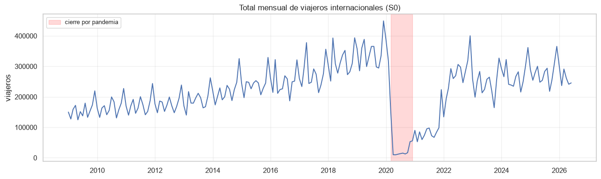

*Figura 1. Total mensual de Turistas + Excursionistas. El área sombreada identifica el período de cierre y restricciones por la pandemia.*

### 4.b Top 10 países de residencia

El Top 3 por número acumulado de viajeros está formado por El Salvador con 14.1 millones, Guatemala con 13.9 millones y Estados Unidos con 7.0 millones. Sin embargo, en el caso de Guatemala esos registros corresponden a residentes guatemaltecos que regresan al país y no a turistas extranjeros. Por esa razón, para el análisis de las series de tiempo no se considera Guatemala y el Top 3 queda conformado por El Salvador, Estados Unidos y Honduras.

También se puede ver que existe una fuerte concentración regional, ya que los cuatro países con mayor cantidad de viajeros son El Salvador, Guatemala, Estados Unidos y Honduras. Esto indica que la mayor parte de los visitantes proviene de Centroamérica y Norteamérica, por lo que el mercado emisor no está muy diversificado.

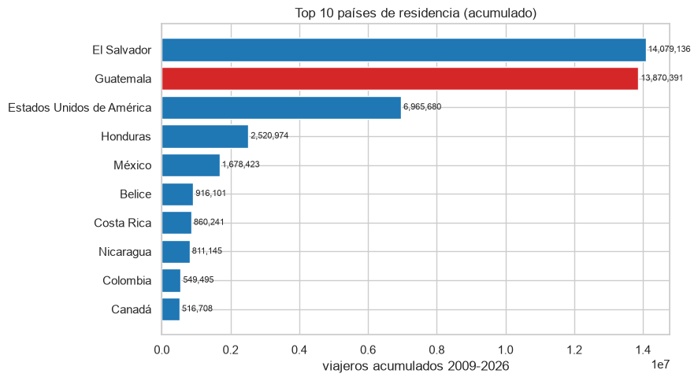

*Figura 2. Ranking acumulado construido sobre Turista + Excursionista. Guatemala se muestra como anomalía analítica y se excluye de las series de turismo receptivo.*

### 4.c Top regiones

Se puede ver que Centroamérica concentra la mayor cantidad de viajeros, con 33.3 millones, lo que representa alrededor del 71.3% del total. En segundo lugar se encuentra América del Norte con 9.2 millones de viajeros, equivalente a cerca del 19.6%. El resto de las regiones representa aproximadamente el 9.1% del total.

Estos resultados muestran que la mayor parte del turismo receptivo de Guatemala proviene de países cercanos, especialmente de la región centroamericana.

Se encontraron 821 viajeros con `Región dos = 0`. Ese valor funciona como un código sin clasificación geográfica, no como una región válida; se conserva en el total para no perder viajeros, pero se excluye del ranking regional.

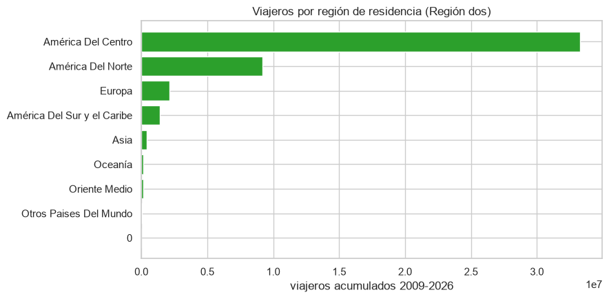

*Figura 3. Distribución acumulada por región válida de residencia.*

### 4.d Distribución por vía y frontera

Se puede ver que la vía terrestre concentra la mayor parte de los visitantes, con el 59.1% del total, seguida por la vía aérea con el 40.7%. En cambio, la vía marítima representa apenas el 0.2%, por lo que su participación es muy baja y no se consideró para el análisis.

A nivel de fronteras, La Aurora es el principal punto de ingreso al país con 19.0 millones de viajeros. Después se encuentran Valle Nuevo con 10.1 millones y San Cristóbal con 4.2 millones. Estas tres fronteras fueron seleccionadas para el análisis porque representan dos tipos de ingreso diferentes: el transporte aéreo y el terrestre, lo que permite comparar el comportamiento de ambos perfiles de viajeros.

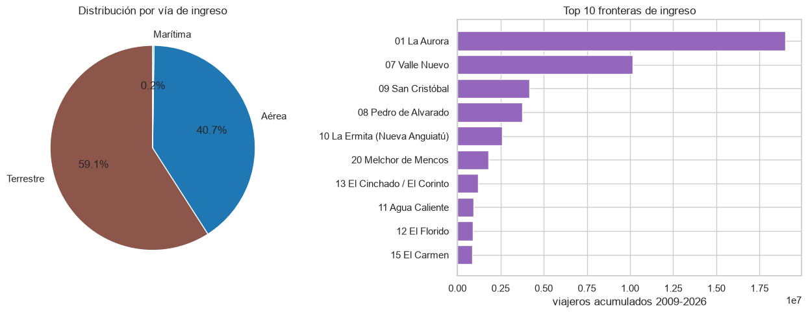

*Figura 4. Participación por vía de ingreso y ranking de fronteras para Turista + Excursionista.*

### 4.e Nulos, duplicados y valores atípicos

No se encontraron valores nulos en la base de datos. Además, se identificaron 22 combinaciones que aparecen repetidas, pero estas no corresponden a duplicados, ya que se diferencian por la variable `Agrupación Residencia`. Por esa razón no fue necesario eliminar ningún registro.

Con los límites calculados sobre los 210 meses, la regla del IQR identifica un solo valor atípico: diciembre de 2019, con 449,114 viajeros, por encima del límite superior de 439,781. Los mínimos de la pandemia son extraordinarios desde el punto de vista temporal, pero el menor valor observado (9,779 en mayo de 2020) queda apenas por encima del límite inferior del IQR (9,274), por lo que esta regla global no los clasifica como atípicos. No se elimina ninguna observación: diciembre de 2019 es un pico real y la pandemia es un cambio estructural que debe conservarse y explicarse durante el modelado.

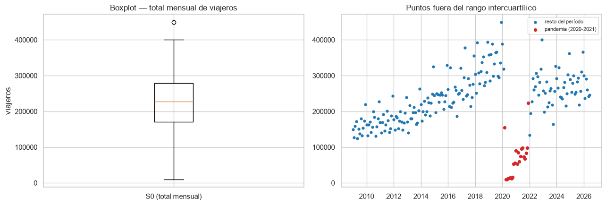

*Figura 5. El rombo rojo identifica el único mes clasificado como atípico por la regla IQR. El área amarilla muestra la pandemia como evento estructural.*

### 4.f Estadísticos descriptivos

| Estadístico | Valor |
|---|---:|
| Media | 222,438 |
| Mediana | 227,606 |
| Desviación estándar | 84,725 |
| Mínimo | 9,779 |
| Máximo | 449,114 |

Se puede ver que la media de la serie es de 222,438 viajeros y la mediana es de 227,606, por lo que ambas medidas son bastante similares. Esto indica que la distribución de los datos no presenta una asimetría muy marcada, aunque los valores extremadamente bajos registrados durante la pandemia influyen en la distribución. Además, la desviación estándar es de 84,725 viajeros, lo que muestra una variabilidad importante en la serie.

También se puede ver que la serie que incluye todos los tipos de viajero presenta una caída importante a partir de 2023 debido al cambio metodológico. En cambio, la serie utilizada para el análisis, que solo considera Turista y Excursionista, mantiene un comportamiento consistente durante todo el período.

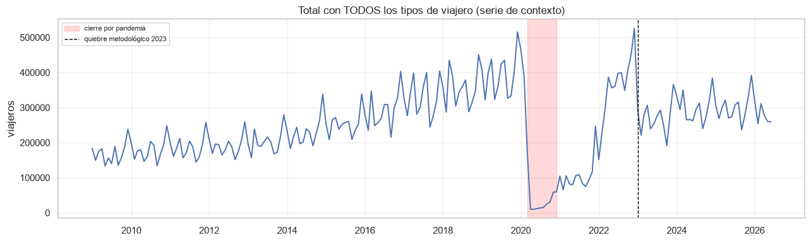

*Figura 6. Serie auxiliar utilizada para evidenciar el quiebre metodológico de 2023. Esta serie no se usa en el modelado.*

### 4.g Comportamiento durante y después de la pandemia

Se puede ver que en 2020 el total anual de viajeros disminuyó un 74.4% con respecto a 2019, al pasar de 4.13 millones a 1.06 millones de viajeros. La mayor caída se registró en mayo de 2020, cuando solo ingresaron 9,779 viajeros.

A partir de ese momento la recuperación fue gradual y no fue hasta diciembre de 2022 cuando la serie volvió a alcanzar un nivel similar al observado antes de la pandemia. Además, la partición de los datos utilizada para entrenar y evaluar los modelos se realiza en marzo de 2021, por lo que el conjunto de entrenamiento solo incluye el período de la caída y el inicio de la recuperación. Como consecuencia, es de esperarse que los modelos tengan dificultades para representar el comportamiento de la serie durante el período de recuperación incluido en el conjunto de prueba.

## 5. Análisis de las series seleccionadas para el avance

Para este avance se analizaron las series S0, total mensual obligatorio, y S1, ingresos por La Aurora. Las gráficas muestran todo el período como contexto, pero la descomposición y las pruebas de estacionariedad se calculan exclusivamente con los 147 meses de entrenamiento. De esta forma, el conjunto de prueba permanece fuera de las decisiones metodológicas.

### 5.1 Serie S0 — Total mensual de viajeros internacionales

| Propiedad | Resultado |
|---|---|
| Inicio y fin | Enero 2009 – junio 2026 |
| Frecuencia | Mensual, `m=12` |
| Entrenamiento | Enero 2009 – marzo 2021, 147 meses |
| Prueba | Abril 2021 – junio 2026, 63 meses |
| Mínimo en entrenamiento | 9,779, mayo 2020 |
| Máximo en entrenamiento | 449,114, diciembre 2019 |

#### Comportamiento observado

Antes de la pandemia se distingue una tendencia creciente y oscilaciones que se repiten anualmente. El máximo ocurre en diciembre de 2019. Desde marzo de 2020 se observa una ruptura abrupta y el entrenamiento termina cuando la recuperación todavía era incompleta. Esto implica que la media cambia con el tiempo y que la fase final del entrenamiento no representa el régimen incluido en buena parte del conjunto de prueba.

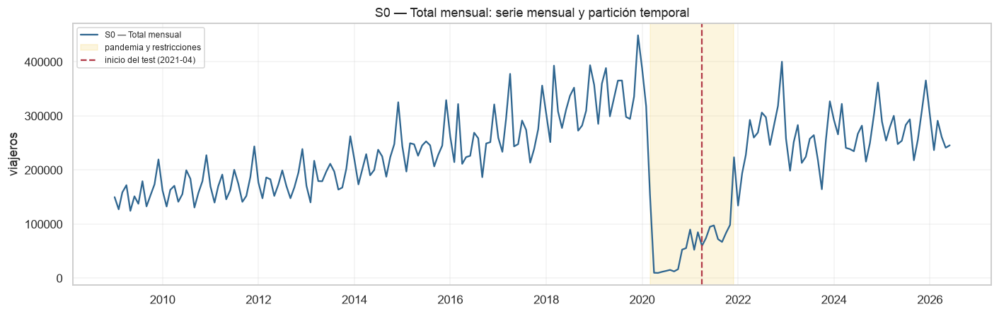

*Figura 7. Serie total, período pandémico y corte entre entrenamiento y prueba.*

#### Tendencia, estacionalidad y varianza

La descomposición aditiva del entrenamiento obtiene una fuerza de tendencia de 0.821 y una fuerza estacional de 0.467. La tendencia ascendente se rompe en 2020 y la componente estacional conserva un patrón anual. En consecuencia, no es razonable asumir una media constante.

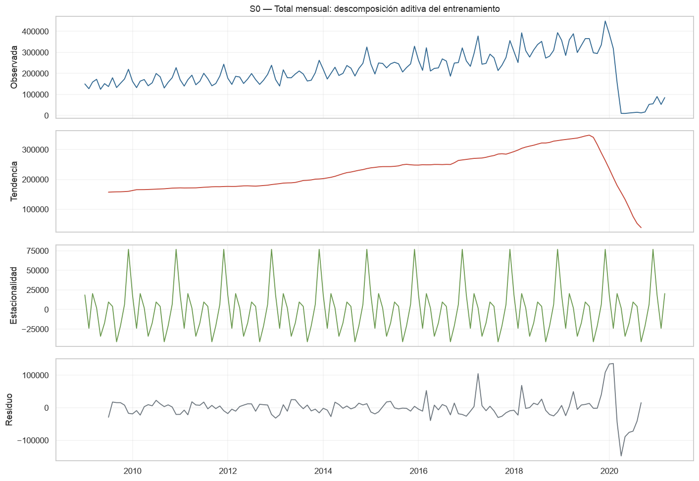

*Figura 8. Componentes observada, tendencia, estacionalidad y residuo de S0 sobre entrenamiento.*

La serie es estrictamente positiva, por lo que se adopta una transformación logarítmica. El logaritmo expresa los cambios de manera relativa y comprime la amplitud de los picos y del choque pandémico. Sin embargo, no elimina la ruptura estructural de 2020; esta debe mantenerse como limitación del modelado.

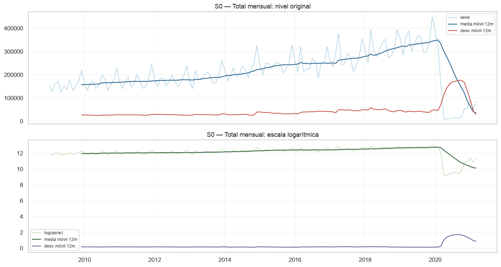

*Figura 9. Comparación de media y desviación móvil de 12 meses en nivel y escala logarítmica.*

#### Estacionariedad en media

La ACF del nivel presenta persistencia y un decaimiento lento. La prueba ADF en nivel obtiene un estadístico de -2.364 y `p=0.152`, por lo que no rechaza la presencia de raíz unitaria al 5%. El logaritmo sin diferenciar tampoco es suficiente (`p=0.116`).

| Transformación S0 | ADF | p ADF | KPSS | p KPSS | Interpretación |
|---|---:|---:|---:|---:|---|
| Nivel | -2.364 | 0.152 | 0.402 | 0.076 | Resultado mixto; evidencia visual y ADF indican no estacionariedad |
| Log | -2.499 | 0.116 | 0.175 | ≥0.100 | El logaritmo por sí solo no elimina la raíz unitaria |
| Primera diferencia del log | -3.085 | 0.028 | 0.051 | ≥0.100 | Ambas pruebas son consistentes con estacionariedad |
| Diferencia estacional del log | 0.066 | 0.964 | 0.554 | 0.029 | No estacionaria |
| Diferencia regular y estacional | -6.539 | <0.001 | 0.037 | ≥0.100 | Ambas pruebas son consistentes con estacionariedad |

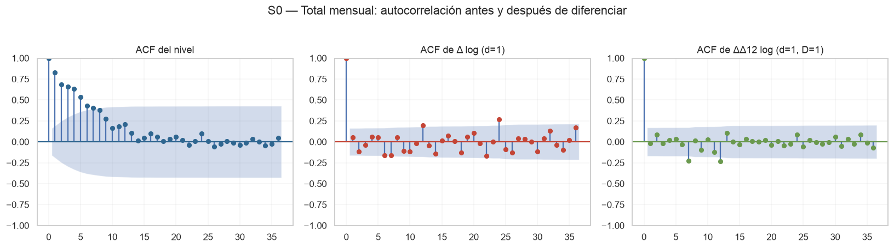

*Figura 10. ACF del nivel, primera diferencia logarítmica y combinación regular-estacional.*

Se propone `d=1`, porque la primera diferencia del logaritmo supera conjuntamente ADF y KPSS. Debido al patrón mensual y los picos en rezagos estacionales, `D=1` se conservará como candidato para los modelos SARIMA de la entrega final.

### 5.2 Serie S1 — Ingresos por La Aurora

| Propiedad | Resultado |
|---|---|
| Inicio y fin | Enero 2009 – junio 2026 |
| Frecuencia | Mensual, `m=12` |
| Entrenamiento | Enero 2009 – marzo 2021, 147 meses |
| Prueba | Abril 2021 – junio 2026, 63 meses |
| Mínimo en entrenamiento | 484, abril 2020 |
| Máximo en entrenamiento | 157,465, diciembre 2019 |

#### Comportamiento observado

La Aurora presenta crecimiento gradual y picos anuales antes de 2020. Durante el cierre pandémico cae a valores cercanos a cero. Al igual que S0, su entrenamiento concluye antes de que el aeropuerto recupere el patrón habitual, por lo que la evaluación predictiva estará expuesta a un cambio de régimen.

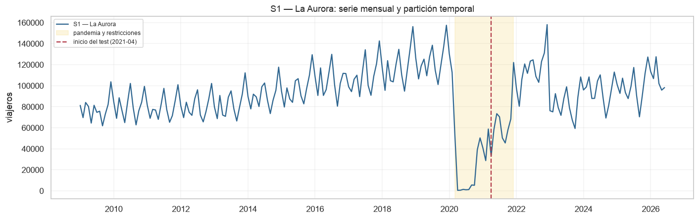

*Figura 11. Serie de La Aurora, período pandémico y corte entre entrenamiento y prueba.*

#### Tendencia, estacionalidad y varianza

La fuerza de tendencia es 0.811 y la fuerza estacional es 0.559. La estacionalidad es más marcada que en S0, pero la tendencia se rompe durante 2020. La media no es constante y los residuos se vuelven especialmente dispersos alrededor del choque.

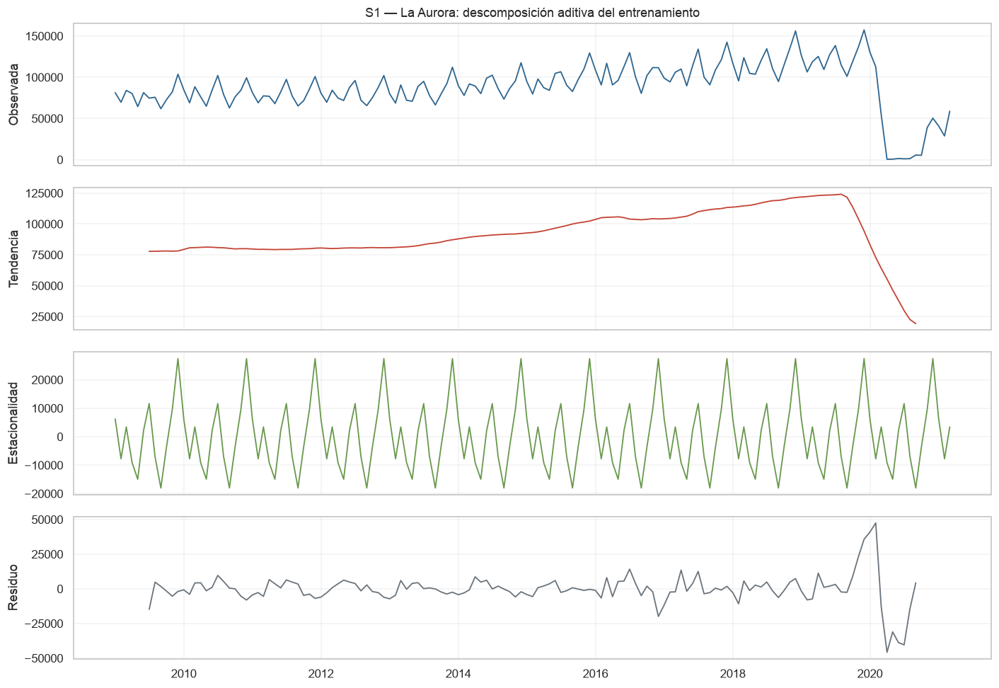

*Figura 12. Componentes observada, tendencia, estacionalidad y residuo de La Aurora sobre entrenamiento.*

Como todos los valores son positivos, también se utiliza `log(S1)`. Esta escala permite interpretar la estacionalidad en términos proporcionales y reduce la influencia de los picos. El valor mínimo de 484 viajeros sigue representando una ruptura extraordinaria aun después de transformar.

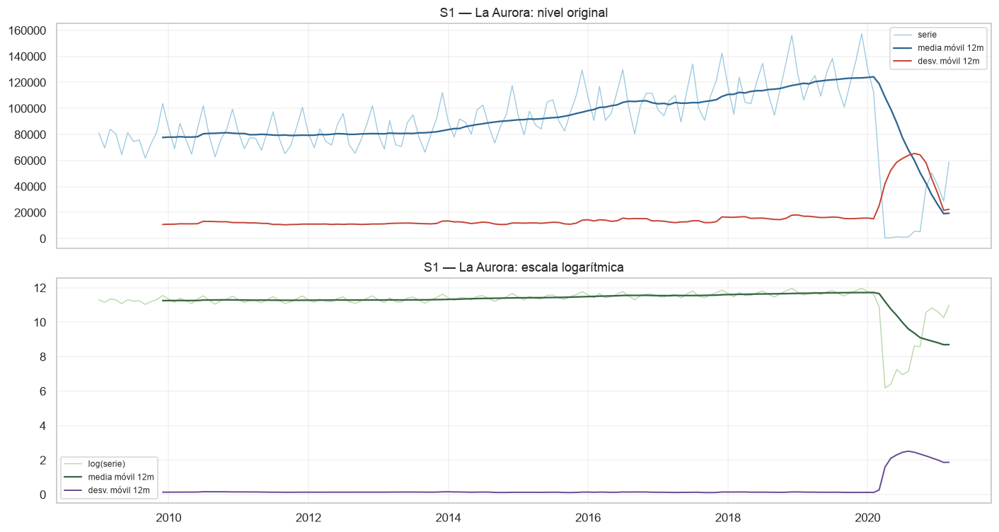

*Figura 13. Comparación de media y desviación móvil de 12 meses en nivel y escala logarítmica.*

#### Estacionariedad en media

ADF en nivel obtiene un estadístico de -2.370 y `p=0.150`, por lo que no rechaza la raíz unitaria. El logaritmo sin diferenciar tampoco es estacionario según ADF (`p=0.273`). La persistencia visible en la ACF es consistente con este resultado.

| Transformación S1 | ADF | p ADF | KPSS | p KPSS | Interpretación |
|---|---:|---:|---:|---:|---|
| Nivel | -2.370 | 0.150 | 0.231 | ≥0.100 | Resultado mixto; ADF y la ACF indican no estacionariedad |
| Log | -2.032 | 0.273 | 0.254 | ≥0.100 | El logaritmo por sí solo no elimina la raíz unitaria |
| Primera diferencia del log | -3.095 | 0.027 | 0.024 | ≥0.100 | Ambas pruebas son consistentes con estacionariedad |
| Diferencia estacional del log | -0.758 | 0.831 | 0.490 | 0.044 | No estacionaria |
| Diferencia regular y estacional | -6.213 | <0.001 | 0.033 | ≥0.100 | Ambas pruebas son consistentes con estacionariedad |

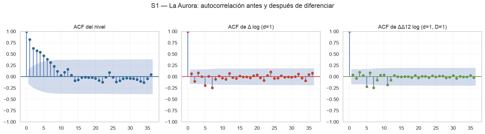

*Figura 14. ACF del nivel, primera diferencia logarítmica y combinación regular-estacional.*

Se propone `d=1`. La estacionalidad visible y la fuerza estacional de 0.559 justifican evaluar `D=1` como parámetro estacional candidato durante el ajuste de SARIMA.

### 5.3 Resumen de las dos series

| Serie | Inicio–fin | Frecuencia | ¿Estacionaria en nivel? | Transformación | `d` propuesto | `D` candidato |
|---|---|---|---|---|---:|---:|
| S0 — Total mensual | ene 2009–jun 2026 | mensual (`m=12`) | No | log | 1 | 1 |
| S1 — La Aurora | ene 2009–jun 2026 | mensual (`m=12`) | No | log | 1 | 1 |

## 6. Limitaciones y siguientes pasos

- La pandemia constituye un cambio estructural y no un valor erróneo; ninguna observación se elimina.
- El entrenamiento termina en marzo de 2021 y no contiene la recuperación completa. Por ello, los modelos pueden subestimar el conjunto de prueba.
- KPSS y ADF tienen hipótesis nulas opuestas. Cuando difieren en nivel, el dictamen se apoya también en la tendencia, la descomposición y la ACF.
- La elección definitiva de `D`, así como de `p` y `q`, se realizará en la entrega final mediante ACF/PACF, comparación de varios ARIMA/SARIMA, diagnóstico de residuos y métricas sobre el conjunto de prueba.
