# Laboratorio 1 — Series de Tiempo: Informe final (borrador)

**Curso:** CC3084 — Data Science
**Entrega final:** domingo 26 de julio de 2026, 23:59
**Equipo de trabajo:** Persona A, Persona B y Persona C
**Repositorio:** `Laboratorio-1-Series-de-Tiempo` — enlace pendiente de confirmar en el cierre

> **Estado de este documento:** los bloques A y B de la Parte II están
> integrados. S0 y las tres fronteras S1–S3 cuentan con el flujo completo y el
> comparativo de Fronteras. Para el cierre final todavía falta completar S4,
> el comparativo de Países, la tabla global, los hallazgos consolidados y las
> conclusiones.

---

## Resumen

Este laboratorio construye siete series mensuales de viajeros internacionales
a Guatemala (S0, total; S1–S3, fronteras; S4–S6, países) a partir de
`Base_Migracion_2009-2026jun.xlsx`, y compara modelos ARIMA/SARIMA, Prophet,
Holt-Winters, suavizamiento exponencial simple y Seasonal Naive sobre una
partición temporal de 147 meses de entrenamiento y 63 de prueba. Hasta este
punto de la cascada, S0, S1, S2, S3, S5 y S6 tienen el flujo completo: gráfica,
descomposición, estacionariedad, selección de órdenes, ajuste de modelos,
diagnóstico de residuos y pronóstico de los 63 meses de prueba. S4 y el
comparativo de Países quedan pendientes para el cierre.

## 1. Descripción del conjunto de datos

El dataset `Base_Migracion_2009-2026jun.xlsx` contiene información sobre el
ingreso de viajeros internacionales a Guatemala desde enero de 2009 hasta
junio de 2026. En total, cuenta con 161,036 registros distribuidos en 210
meses consecutivos. Los datos fueron proporcionados únicamente con fines
académicos y no corresponden a cifras oficiales del INGUAT ni del Instituto
Guatemalteco de Migración.

La base de datos está organizada en formato largo, donde cada fila representa
una combinación de la fecha, la vía de ingreso, la frontera, el país de
residencia y el tipo de viajero. La variable `Viajero` registra la cantidad de
personas para cada una de esas combinaciones.

| Variable | Descripción |
|---|---|
| `Año`, `Mes cod`, `Mes` | Fecha del registro |
| `Vía` | Medio de ingreso al país |
| `Frontera` | Puesto fronterizo de ingreso |
| `País` | País de residencia o agrupación de mercado |
| `Región`, `Región dos`, `Regiones OMT`, `MCEO`, `Agrupación Residencia` | Clasificaciones geográficas |
| `Tipo de Viajero` | Turista, Excursionista, Viajero o Cruceristas |
| `Viajero` | Cantidad de viajeros registrados |

## 2. Limpieza y decisiones metodológicas

Como primer paso se realizó la lectura de la base de datos y se construyó una
variable de fecha utilizando el año y el mes de cada registro. Posteriormente
se llevó a cabo el proceso de limpieza, donde se unificaron diferentes formas
de escribir algunos países, se verificó que no existieran valores nulos y se
revisaron los registros repetidos. Aunque se encontraron algunas combinaciones
repetidas, estas correspondían a diferencias en la variable `Agrupación
Residencia`, por lo que no fue necesario eliminar ningún registro.

Después de la limpieza se construyeron las series de tiempo utilizando
únicamente las categorías de Turista y Excursionista, ya que son las que
mantienen un criterio consistente durante todo el período de estudio.

Para el análisis se seleccionaron dos categorías: fronteras y países de
residencia. En ambos casos se trabajó con las tres categorías que registraron
la mayor cantidad de viajeros, ya que permiten analizar tanto los principales
puntos de ingreso al país como los mercados de origen con mayor participación.

Finalmente, los datos se dividieron en un conjunto de entrenamiento y otro de
prueba utilizando una partición temporal del 70% y 30%, respectivamente.

| Conjunto | Período |
|----------|---------|
| Entrenamiento | Enero 2009 – Marzo 2021 |
| Prueba | Abril 2021 – Junio 2026 |

Durante la exploración de la base de datos se identificaron algunas
características adicionales que debían tomarse en cuenta antes del análisis.

| Aspecto | Descripción |
|---|---|
| Cambio metodológico en 2023 | A partir de 2023 cambia la forma en que se clasifican los viajeros, por lo que la categoría `Viajero` deja de ser comparable con los años anteriores. |
| Cambio en `País` | Desde 2023 algunos países pasan a registrarse como agrupaciones de mercado. |
| Cruceristas | Se manejan de forma diferente al resto de viajeros, por lo que no se utilizaron en el análisis. |
| Vía marítima | Bajo el filtro utilizado deja de registrar movimiento desde 2017, por lo que no se consideró para el análisis. |
| Valores decimales | La variable `Viajero` contiene estimaciones, por lo que puede presentar valores decimales. |
| Año 2026 | Solo incluye información hasta junio, por lo que no es comparable con años completos. |
| Pandemia | La caída registrada durante 2020 corresponde a un evento real, por lo que esos datos se conservaron. |

## 3. Análisis exploratorio

### 3.a Serie temporal del total mensual

Se puede ver que entre 2009 y 2019 la serie mantiene una tendencia de
crecimiento y también presenta un patrón estacional, ya que los valores altos
y bajos se repiten aproximadamente cada 12 meses, coincidiendo con las
temporadas alta y baja del turismo. En marzo de 2020 ocurre una caída muy
fuerte debido al cierre de fronteras por la pandemia y el valor más bajo se
registra en mayo de 2020, con 9,779 viajeros, lo que equivale a solo el 2.8%
del promedio histórico de 222,438 viajeros.

Después de ese punto, la serie empieza a recuperarse poco a poco durante 2021
y 2022. La serie filtrada se mantiene más estable frente al quiebre
metodológico de 2023 porque solo incluye Turista y Excursionista, categorías
comparables durante todo el período. El cambio de clasificación afecta
principalmente a la categoría `Viajero` y se aprecia con claridad únicamente
en la serie auxiliar que contiene todos los tipos.

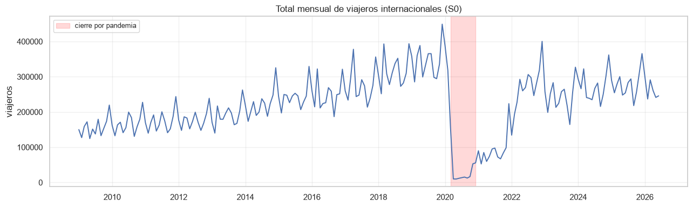

*Figura 1. Total mensual de Turistas + Excursionistas. El área sombreada
identifica el período de cierre y restricciones por la pandemia.*

### 3.b Top 10 países de residencia

El Top 3 por número acumulado de viajeros está formado por El Salvador con
14.1 millones, Guatemala con 13.9 millones y Estados Unidos con 7.0 millones.
Para seguir literalmente el criterio del enunciado, estos tres países se
conservan en el análisis. En el caso de Guatemala, los registros corresponden
principalmente a residentes guatemaltecos que regresan al país, por lo que
esta serie debe interpretarse como movilidad de retorno y no como turismo
extranjero.

Guatemala deja de aparecer como categoría individual desde enero de 2023, por
lo que su serie presenta 42 meses consecutivos en cero hasta junio de 2026.
Este tramo se debe al cambio de granularidad de la variable `País` y no
representa la desaparición real del retorno de residentes. Esta limitación se
consideró al transformar, modelar y evaluar S6 en la sección 8.3.

También se puede ver que existe una fuerte concentración regional, ya que los
cuatro países con mayor cantidad de viajeros son El Salvador, Guatemala,
Estados Unidos y Honduras. Esto indica que la mayor parte de los visitantes
proviene de Centroamérica y Norteamérica, por lo que el mercado emisor no está
muy diversificado.

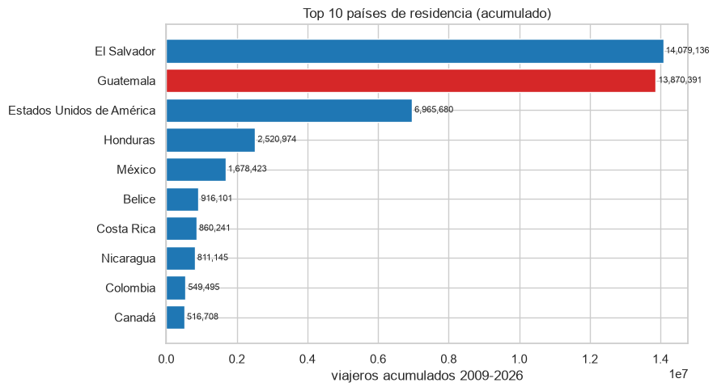

*Figura 2. Ranking acumulado construido sobre Turista + Excursionista.
Guatemala se resalta como un caso de interpretación especial, pero se
conserva por pertenecer al Top 3 literal.*

### 3.c Top regiones

Se puede ver que Centroamérica concentra la mayor cantidad de viajeros, con
33.3 millones, lo que representa alrededor del 71.3% del total. En segundo
lugar se encuentra América del Norte con 9.2 millones de viajeros, equivalente
a cerca del 19.6%. El resto de las regiones representa aproximadamente el
9.1% del total.

Estos resultados muestran que la mayor parte del turismo receptivo de
Guatemala proviene de países cercanos, especialmente de la región
centroamericana.

Se encontraron 821 viajeros con `Región dos = 0`. Ese valor funciona como un
código sin clasificación geográfica, no como una región válida; se conserva
en el total para no perder viajeros, pero se excluye del ranking regional.

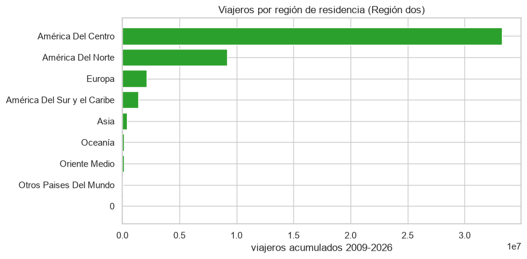

*Figura 3. Distribución acumulada por región válida de residencia.*

### 3.d Distribución por vía y frontera

Se puede ver que la vía terrestre concentra la mayor parte de los visitantes,
con el 59.1% del total, seguida por la vía aérea con el 40.7%. En cambio, la
vía marítima representa apenas el 0.2%, por lo que su participación es muy
baja y no se consideró para el análisis.

A nivel de fronteras, La Aurora es el principal punto de ingreso al país con
19.0 millones de viajeros. Después se encuentran Valle Nuevo con 10.1 millones
y San Cristóbal con 4.2 millones. Estas tres fronteras fueron seleccionadas
para el análisis porque representan dos tipos de ingreso diferentes: el
transporte aéreo y el terrestre, lo que permite comparar el comportamiento de
ambos perfiles de viajeros.

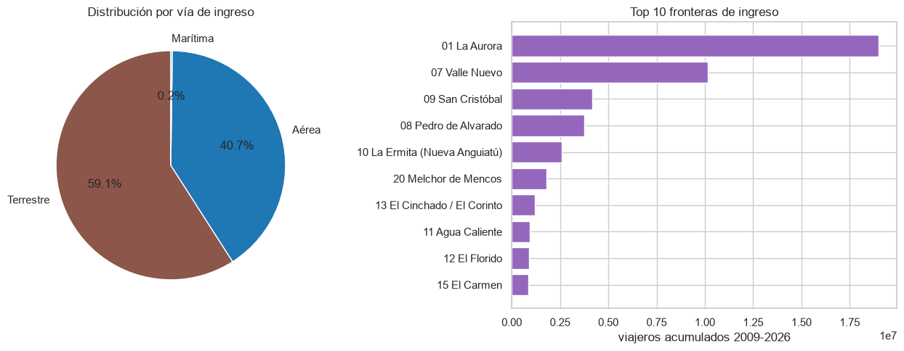

*Figura 4. Participación por vía de ingreso y ranking de fronteras para
Turista + Excursionista.*

### 3.e Nulos, duplicados y valores atípicos

No se encontraron valores nulos en la base de datos. Además, se identificaron
22 combinaciones que aparecen repetidas, pero estas no corresponden a
duplicados, ya que se diferencian por la variable `Agrupación Residencia`. Por
esa razón no fue necesario eliminar ningún registro.

Con los límites calculados sobre los 210 meses, la regla del IQR identifica un
solo valor atípico: diciembre de 2019, con 449,114 viajeros, por encima del
límite superior de 439,781. Los mínimos de la pandemia son extraordinarios
desde el punto de vista temporal, pero el menor valor observado (9,779 en
mayo de 2020) queda apenas por encima del límite inferior del IQR (9,274), por
lo que esta regla global no los clasifica como atípicos. No se elimina ninguna
observación: diciembre de 2019 es un pico real y la pandemia es un cambio
estructural que debe conservarse y explicarse durante el modelado.

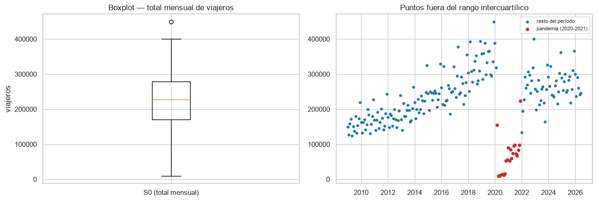

*Figura 5. El rombo rojo identifica el único mes clasificado como atípico por
la regla IQR. El área amarilla muestra la pandemia como evento estructural.*

### 3.f Estadísticos descriptivos

| Estadístico | Valor |
|---|---:|
| Media | 222,438 |
| Mediana | 227,606 |
| Desviación estándar | 84,725 |
| Mínimo | 9,779 |
| Máximo | 449,114 |

Se puede ver que la media de la serie es de 222,438 viajeros y la mediana es
de 227,606, por lo que ambas medidas son bastante similares. Esto indica que
la distribución de los datos no presenta una asimetría muy marcada, aunque los
valores extremadamente bajos registrados durante la pandemia influyen en la
distribución. Además, la desviación estándar es de 84,725 viajeros, lo que
muestra una variabilidad importante en la serie.

También se puede ver que la serie que incluye todos los tipos de viajero
presenta una caída importante a partir de 2023 debido al cambio metodológico.
En cambio, la serie utilizada para el análisis, que solo considera Turista y
Excursionista, mantiene un comportamiento consistente durante todo el período.

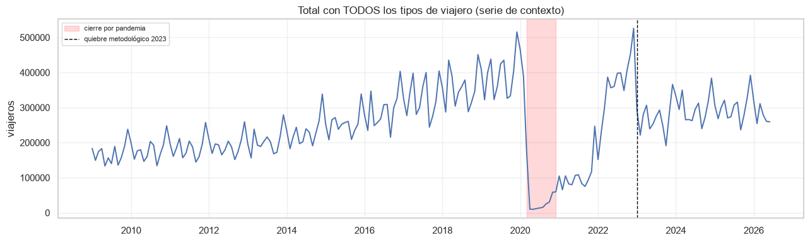

*Figura 6. Serie auxiliar utilizada para evidenciar el quiebre metodológico de
2023. Esta serie no se usa en el modelado.*

### 3.g Comportamiento durante y después de la pandemia

Se puede ver que en 2020 el total anual de viajeros disminuyó un 74.4% con
respecto a 2019, al pasar de 4.13 millones a 1.06 millones de viajeros. La
mayor caída se registró en mayo de 2020, cuando solo ingresaron 9,779
viajeros.

A partir de ese momento la recuperación fue gradual y no fue hasta diciembre
de 2022 cuando la serie volvió a alcanzar un nivel similar al observado antes
de la pandemia. Además, la partición de los datos utilizada para entrenar y
evaluar los modelos se realiza en marzo de 2021, por lo que el conjunto de
entrenamiento solo incluye el período de la caída y el inicio de la
recuperación. Como consecuencia, es de esperarse que los modelos tengan
dificultades para representar el comportamiento de la serie durante el
período de recuperación incluido en el conjunto de prueba.

## 4. Construcción de las siete series

A partir del dataset limpio se construyeron siete series mensuales con
frecuencia `MS` y período estacional `m=12`, cada una con 210 observaciones:

| Serie | Categoría | Filtro |
|---|---|---|
| S0 | Total mensual | Turista + Excursionista, sin filtrar por frontera ni país |
| S1 | Frontera | 01 La Aurora |
| S2 | Frontera | 07 Valle Nuevo |
| S3 | Frontera | 09 San Cristóbal |
| S4 | País | El Salvador |
| S5 | País | Estados Unidos |
| S6 | País | Guatemala |

Antes de comenzar el modelado final, Persona A corrigió el Top 3 de países
para seguir literalmente el criterio de mayor cantidad acumulada de viajeros:
El Salvador, Guatemala y Estados Unidos. La serie S6 usada originalmente en el
avance correspondía a Honduras y fue reemplazada por Guatemala en
`src/config.py`; `data/processed/series/S6_guatemala.csv` fue regenerada con
las 210 observaciones esperadas. Este cambio fue preparado y documentado por
Persona A, y aceptado por Persona B tras verificar que el pipeline
(`src/run_pipeline.py`) se ejecuta sin errores y que S6 contiene los 42 ceros
consecutivos esperados desde enero de 2023.

## 5. Metodología de modelado y evaluación

Para comparar las series bajo las mismas condiciones se mantuvo la partición
temporal definida desde el avance. Los primeros 147 meses, desde enero de 2009
hasta marzo de 2021, se utilizaron para estudiar el comportamiento de cada
serie y ajustar los modelos. Los 63 meses restantes, desde abril de 2021 hasta
junio de 2026, se reservaron para medir qué tan bien pronostica cada método.
Los datos no se mezclaron ni se ordenaron al azar, porque en una serie de
tiempo el orden de los meses es parte esencial de la información.

Antes de modelar se revisaron la tendencia, la estacionalidad, la estabilidad
de la media y la variación. También se utilizaron las pruebas ADF y KPSS,
junto con las gráficas ACF y PACF, para decidir si era necesario diferenciar
la serie y para proponer valores razonables de `p`, `d`, `q`, `P`, `D` y `Q`.
Estas decisiones se tomaron únicamente con el período de entrenamiento,
evitando utilizar anticipadamente la información de prueba.

En cada serie se compararon al menos tres candidatos ARIMA o SARIMA, una
sugerencia acotada de `auto_arima`, Prophet, Holt-Winters, suavizamiento
exponencial simple y Seasonal Naive. Para todos los métodos se generaron
exactamente 63 pronósticos mensuales. El desempeño se midió con MAE y RMSE
sobre los mismos meses; MAPE se incluyó como referencia adicional cuando el
valor observado era distinto de cero. AIC y BIC se utilizaron solamente para
comparar candidatos ARIMA/SARIMA ajustados sobre la misma serie.

El mejor modelo de cada serie se eligió principalmente por su RMSE en prueba,
pero también se revisaron los residuos y la prueba de Ljung-Box. Esto es
importante porque un modelo puede ajustarse bien al entrenamiento y aun así
fallar al pronosticar. De hecho, el corte elegido deja buena parte de la
recuperación pospandemia dentro de la prueba; por eso los errores también
reflejan un cambio de comportamiento que los modelos no habían visto durante
su ajuste.

Para S0, S1 y S2 se aplicó una transformación logarítmica porque todos los
valores son positivos. En S5 y S6 se utilizó `log1p`, ya que ambas series
contienen meses en cero: S5 durante el cierre de 2020 y S6 desde enero de
2023 por el cambio de granularidad de `País`. Esta transformación permite
conservar esos meses sin sustituirlos ni eliminarlos. Finalmente, todos los
pronósticos se devolvieron a su escala original para que las métricas y
gráficas pudieran interpretarse directamente en cantidad de viajeros.

## 6. Serie S0 — Total mensual

La serie S0 representa el total mensual de turistas y excursionistas
registrados. Contiene 210 observaciones, desde enero de 2009 hasta junio de
2026. Los primeros 147 meses se utilizaron como entrenamiento y los 63 meses
finales como prueba. Esta división es especialmente exigente porque el
período de prueba comienza en abril de 2021, cuando la movilidad todavía
estaba recuperándose del cierre provocado por la pandemia.

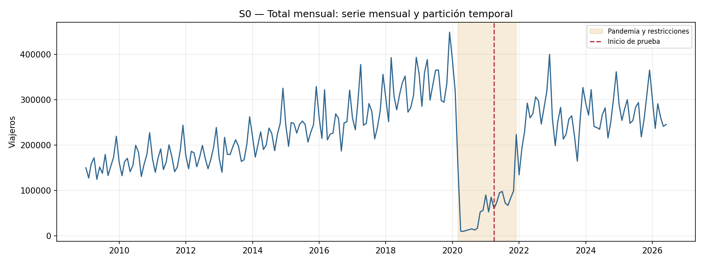

La gráfica permite apreciar tres etapas. Antes de 2020 existía un crecimiento
general acompañado por picos mensuales repetitivos. En 2020 ocurrió una caída
extraordinaria que no corresponde a la estacionalidad normal. Después del
corte de prueba la serie recuperó rápidamente niveles cercanos a los
anteriores, pero ese nuevo comportamiento apenas estaba comenzando cuando se
cerró el entrenamiento. Esto explica por qué los modelos tienden a quedarse
por debajo de los valores observados entre 2022 y 2026.

### Tendencia y estacionalidad

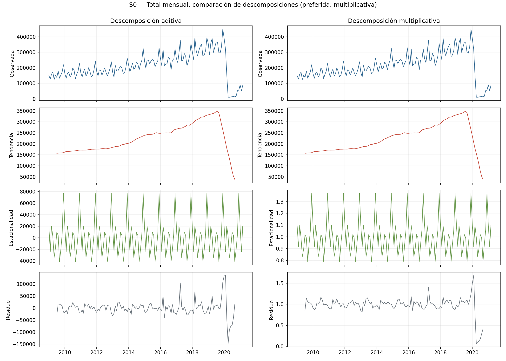

La descomposición confirma que la tendencia es el componente dominante. Su
fuerza estimada fue 0.821, mientras que la fuerza estacional fue 0.467. En
palabras sencillas, el total venía creciendo de manera importante y, sobre ese
crecimiento, aparecían meses altos y bajos que se repetían. El residuo
aumenta alrededor de la pandemia porque una descomposición tradicional no
puede explicar por completo un cierre tan abrupto.

Se compararon las formas aditiva y multiplicativa. Entre 2009 y 2019, la
correlación entre la media y la desviación anual fue 0.904: la amplitud crecía
con el nivel. Por ello la lectura multiplicativa es más apropiada para S0,
aunque la fuerza estacional se calcula con la descomposición aditiva para
mantener la misma fórmula y escala en el comparativo de las siete series.

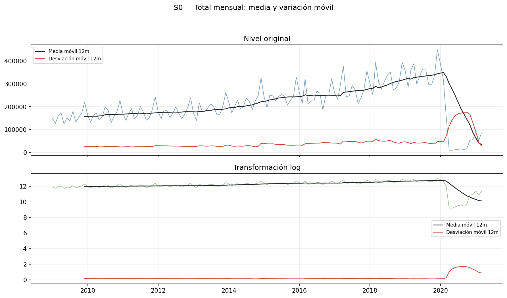

Como S0 no contiene ceros, se aplicó logaritmo. Antes de la pandemia, la
correlación media-desviación pasó de 0.904 en nivel a -0.438 en logaritmo:
desapareció la asociación positiva entre nivel y amplitud, evidencia de que la
transformación estabiliza la varianza. Aun así, el quiebre de 2020 continúa
visible y debe tratarse como un cambio real, no como un atípico eliminable.

### Estacionariedad y selección de órdenes

| Transformación | p ADF | p KPSS | Lectura |
|---|---:|---:|---|
| Nivel | 0.1520 | 0.0763 | Resultado mixto |
| Logaritmo | 0.1156 | 0.1000 | Resultado mixto |
| Logaritmo con `d=1` | 0.0277 | 0.1000 | Estacionaria según ambas pruebas |
| Logaritmo con `D=1` | 0.9636 | 0.0294 | No estacionaria |
| Logaritmo con `d=1` y `D=1` | <0.0001 | 0.1000 | Estacionaria según ambas pruebas |

En la escala logarítmica sin diferenciar, ADF todavía detecta una posible raíz
unitaria. Después de aplicar una diferencia regular, ADF y KPSS coinciden en
que la serie es estacionaria. También se probó una diferencia estacional
porque la ACF mantiene señales alrededor del rezago 12; por esa razón se
compararon candidatos con `d=1` y otros con `d=1, D=1`, sin asumir que la
diferencia estacional debía utilizarse obligatoriamente.

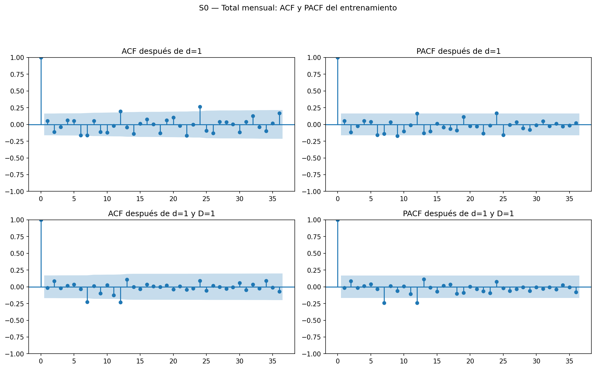

La figura separa la lectura después de `d=1` de la lectura después de
`d=1,D=1`. Con `d=1`, la ACF conserva una señal en el rezago 12 y ni ACF ni
PACF presentan un corte simple en los primeros rezagos. Por eso se tomó
ARIMA(1,1,1) como candidato parsimonioso y se contrastó con dos SARIMA de
órdenes bajos. `auto_arima` propuso (2,0,0)(1,0,1,12); se evaluó, pero su
ausencia de diferenciación no coincide con la conclusión conjunta de ADF y
KPSS, por lo que no se aceptó automáticamente.

### Comparación de modelos y pronóstico

| Modelo | AIC | BIC | MAE | RMSE | MAPE |
|---|---:|---:|---:|---:|---:|
| Prophet | N/A | N/A | 132,305 | 139,549 | 60.89% |
| ARIMA(1,1,1) | 92.36 | 101.27 | 154,873 | 169,524 | 59.30% |
| Suavizamiento exponencial simple | N/A | N/A | 165,373 | 180,598 | 62.91% |
| Holt-Winters | N/A | N/A | 178,162 | 191,100 | 69.82% |
| auto_arima(2,0,0)(1,0,1,12) | 66.50 | 80.96 | 183,943 | 198,151 | 72.25% |
| Seasonal Naive | N/A | N/A | 207,322 | 219,664 | 84.91% |
| SARIMA(1,1,1)(0,1,1,12) | 70.45 | 81.60 | 213,008 | 227,938 | 84.09% |
| SARIMA(2,1,1)(1,1,0,12) | 62.80 | 76.74 | 222,190 | 241,914 | 84.57% |

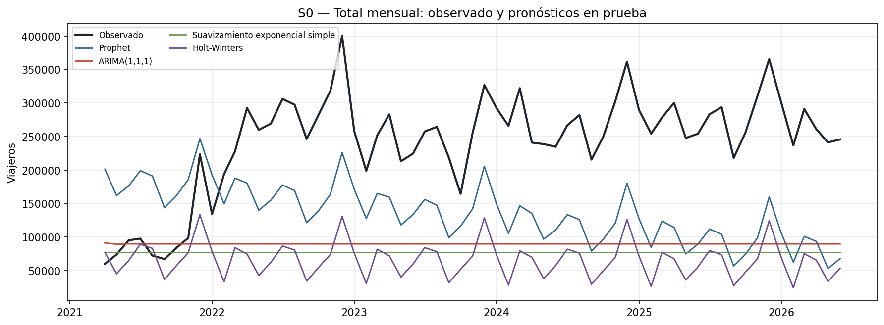

Prophet obtuvo el menor RMSE, con aproximadamente 139,549 viajeros, y el menor
MAE, con 132,305. Sin embargo, su MAPE de 60.89% sigue siendo elevado. La
gráfica confirma que incluso el mejor candidato subestima buena parte de la
recuperación. Por lo tanto, se selecciona Prophet únicamente como el mejor
dentro del conjunto evaluado, no como un modelo de alta precisión.

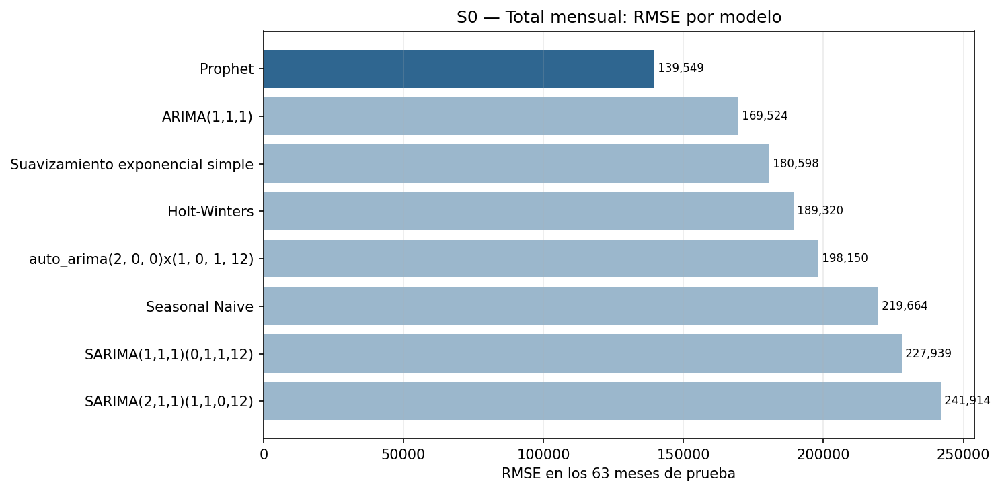

La comparación también muestra que el candidato con menor AIC no fue el que
mejor pronosticó. SARIMA(2,1,1)(1,1,0,12) obtuvo el AIC más bajo entre los
candidatos ARIMA/SARIMA, pero presentó el RMSE más alto de S0. Este resultado
refuerza la necesidad de revisar el desempeño fuera de muestra en lugar de
elegir un modelo únicamente por su ajuste interno.

### Diagnóstico de residuos

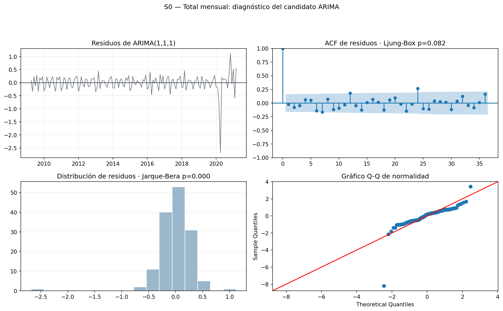

Entre los candidatos ARIMA, ARIMA(1,1,1) obtuvo `p=0.082` en la prueba
resumida de Ljung-Box. Al nivel de 5% no se rechaza la ausencia de
autocorrelación, aunque el resultado no es especialmente amplio. Jarque-Bera
da `p<0.001`: los residuos no son normales y el gráfico Q-Q muestra colas
extremas alrededor de la pandemia. Su error en prueba fue superior al de
Prophet y los residuos de Prophet sí conservaron autocorrelación. Ningún
modelo resuelve por completo el cambio de nivel pospandemia: Prophet
pronostica menos mal, mientras ARIMA(1,1,1) presenta menor autocorrelación
residual.

## 7. Categoría Fronteras

### 7.1 S1 — La Aurora

La serie S1 representa el total mensual de viajeros ingresados por La Aurora,
la principal frontera aérea del país. Contiene 210 observaciones, sin meses
en cero. Los primeros 147 meses se utilizaron como entrenamiento y los 63
meses finales como prueba.

Antes de 2020, La Aurora combina un crecimiento sostenido con picos anuales
propios del tráfico aéreo. En abril de 2020 la serie cae hasta un mínimo de
484 viajeros, una ruptura extraordinaria de la que la recuperación seguía en
curso cuando terminó el entrenamiento.

La fuerza de tendencia es 0.811 y la fuerza estacional es 0.559. En
comparación con S0, La Aurora conserva un patrón estacional más marcado,
coherente con la estacionalidad propia del tráfico aéreo de pasajeros.
La correlación entre media y desviación anual antes de 2020 fue 0.889, por lo
que la amplitud aumenta con el nivel y la descomposición multiplicativa es la
lectura preferida.

Como S1 no contiene ceros, se aplicó logaritmo completo. La correlación
media-desviación cambió de 0.889 en nivel a -0.209 después de transformar, de
modo que el logaritmo elimina la relación positiva que hacía crecer la
varianza con el nivel.

| Transformación | p ADF | p KPSS | Lectura |
|---|---:|---:|---|
| Nivel | 0.1505 | 0.1000 | Resultado mixto |
| Logaritmo | 0.2726 | 0.1000 | Resultado mixto |
| Logaritmo con `d=1` | 0.0269 | 0.1000 | Estacionaria según ambas pruebas |
| Logaritmo con `D=1` | 0.8311 | 0.0440 | No estacionaria |
| Logaritmo con `d=1` y `D=1` | <0.0001 | 0.1000 | Estacionaria según ambas pruebas |

Con `d=1` no aparece un corte limpio en el primer rezago; quedan picos aislados
en los rezagos 5 y 7, muy influidos por el quiebre de 2020. En vez de escoger
un orden alto y frágil, se compararon las alternativas parsimoniosas
ARIMA(1,1,0), ARIMA(0,1,1) y ARIMA(1,1,1), más un SARIMA anual. La segunda fila
de la figura permite revisar por separado los términos estacionales después de
`D=1`.

| Modelo | AIC | BIC | MAE | RMSE | MAPE |
|---|---:|---:|---:|---:|---:|
| ARIMA(1,1,1) | 207.03 | 215.94 | 33,049 | 38,249 | 33.08% |
| ARIMA(0,1,1) | 206.07 | 212.01 | 33,468 | 38,659 | 33.42% |
| ARIMA(1,1,0) | 206.85 | 212.80 | 34,250 | 39,444 | 34.14% |
| Suavizamiento exponencial simple | N/A | N/A | 36,822 | 42,053 | 36.56% |
| Holt-Winters | N/A | N/A | 38,904 | 42,887 | 39.49% |
| Prophet | N/A | N/A | 45,973 | 50,963 | 47.47% |
| SARIMA(1,1,1)(0,1,1,12) | 187.11 | 198.26 | 68,210 | 72,421 | 71.99% |
| auto_arima(1,0,1)(1,0,1,12) | 189.57 | 204.03 | 71,903 | 75,901 | 76.29% |
| Seasonal Naive | N/A | N/A | 75,518 | 79,321 | 81.48% |

ARIMA(1,1,1) obtuvo el menor RMSE (38,249) y el menor MAE (33,049), con
MAPE de 33.1%. El AIC ligeramente menor de ARIMA(0,1,1) no se tradujo en menor
error de prueba, mientras que los candidatos estacionales subestimaron con
mayor fuerza la recuperación.

ARIMA(1,1,1) obtiene `p=0.074` en Ljung-Box; al nivel de 5% no se rechaza la
ausencia de autocorrelación, aunque el margen es estrecho. Jarque-Bera arroja
`p<0.001`, por lo que los residuos no son normales: el histograma y el gráfico
Q-Q muestran que el choque pandémico genera colas extremas. Se selecciona como
el mejor candidato de S1 por RMSE, manteniendo esta limitación.

### 7.2 S2 — Valle Nuevo

La serie S2 representa el total mensual de viajeros ingresados por Valle
Nuevo, la principal frontera terrestre hacia El Salvador. Esta serie no
contaba con exploración, descomposición ni estacionariedad en el avance; el
bloque de Persona B completó ese análisis. Contiene 210 observaciones, con un
mínimo de 80 viajeros en entrenamiento y sin meses en cero.

Valle Nuevo muestra el mismo quiebre pandémico que las demás series: cae a
niveles mínimos durante 2020 y todavía estaba recuperándose cuando terminó el
entrenamiento.

La fuerza de tendencia es 0.766, frente a una fuerza estacional de 0.311. A
diferencia de La Aurora, el tráfico terrestre de Valle Nuevo tiene un patrón
mensual más plano y un crecimiento de fondo más marcado antes de 2020.
La correlación media-desviación fue 0.310, bastante menor que en La Aurora;
por ello la descomposición aditiva es la lectura preferida para S2.

Aunque la relación entre nivel y amplitud es más débil, la escala original
presenta picos grandes y varianza cambiante. Después del logaritmo la
correlación media-desviación deja de ser positiva (pasa de 0.310 a -0.539), de
modo que se conserva la transformación para estabilizar la escala.

| Transformación | p ADF | p KPSS | Lectura |
|---|---:|---:|---|
| Nivel | 0.3648 | 0.0636 | Resultado mixto |
| Logaritmo | 0.1952 | 0.1000 | Resultado mixto |
| Logaritmo con `d=1` | <0.0001 | 0.1000 | Estacionaria según ambas pruebas |
| Logaritmo con `D=1` | 0.7827 | 0.0256 | No estacionaria |
| Logaritmo con `d=1` y `D=1` | <0.0001 | 0.1000 | Estacionaria según ambas pruebas |

Después de `d=1`, tanto la ACF como la PACF muestran un pico negativo
significativo en el rezago 1. Esto motiva comparar por separado un término
AR(1), un MA(1) y su combinación: ARIMA(1,1,0), ARIMA(0,1,1) y
ARIMA(1,1,1). El candidato SARIMA permite comprobar si la estacionalidad
moderada aporta una mejora real.

| Modelo | AIC | BIC | MAE | RMSE | MAPE |
|---|---:|---:|---:|---:|---:|
| Prophet | N/A | N/A | 16,804 | 23,187 | 157.64% |
| Holt-Winters | N/A | N/A | 35,210 | 38,091 | 85.43% |
| Suavizamiento exponencial simple | N/A | N/A | 40,770 | 45,663 | 79.97% |
| ARIMA(1,1,0) | 330.74 | 336.69 | 41,024 | 45,933 | 80.11% |
| ARIMA(0,1,1) | 327.55 | 333.49 | 41,314 | 46,240 | 80.30% |
| ARIMA(1,1,1) | 329.50 | 338.41 | 41,519 | 46,452 | 80.52% |
| auto_arima(1,0,1)(0,0,0,12) | 330.98 | 339.91 | 43,693 | 48,726 | 84.83% |
| Seasonal Naive | N/A | N/A | 44,707 | 49,661 | 91.39% |
| SARIMA(1,1,1)(0,1,1,12) | 303.09 | 314.24 | 47,115 | 51,806 | 96.96% |

Prophet obtuvo claramente el menor RMSE (23,187), muy por debajo del
siguiente candidato (Holt-Winters, 38,126). Su MAPE de 157.6% supera el 100%
porque algunos meses de prueba tienen valores pequeños frente al error
absoluto; por eso el MAPE se reporta solo como referencia adicional y la
selección se basa en RMSE. A diferencia de S1, ningún candidato ARIMA/SARIMA
de S2 produjo un pronóstico inestable.

Los residuos de Prophet conservan autocorrelación (Ljung-Box `p<0.001`), a
pesar de tener el menor error en prueba. ARIMA(1,1,0), el ARIMA con menor RMSE,
tampoco deja ruido blanco (`p=0.014`). ARIMA(1,1,1) queda apenas sobre el
umbral (`p=0.055`), pero pronostica peor. Jarque-Bera rechaza normalidad en
todos los candidatos debido a las observaciones extremas de la pandemia.

### 7.3 S3 — San Cristóbal

S3 corresponde a San Cristóbal, la segunda frontera terrestre del Top 3.
Contiene 210 meses, desde enero de 2009 hasta junio de 2026, sin ceros; el
mínimo del entrenamiento es 14 viajeros.

Antes de 2020 la serie crece, pero con oscilaciones relativas mayores que S1 y
S2. La pandemia la lleva cerca de cero y el entrenamiento termina cuando la
recuperación apenas comienza.

La fuerza de tendencia es 0.707 y la fuerza estacional 0.399. La correlación
media-desviación prepandemia fue 0.529, por lo que se prefiere la
descomposición multiplicativa. El logaritmo reduce esa correlación a -0.468 y
estabiliza la relación entre nivel y amplitud.

| Transformación | p ADF | p KPSS | Lectura |
|---|---:|---:|---|
| Nivel | 0.5854 | 0.0208 | No estacionaria |
| Logaritmo | 0.2527 | 0.1000 | Resultado mixto |
| Logaritmo con `d=1` | 0.9121 | 0.1000 | Resultado mixto |
| Logaritmo con `D=1` | 0.9269 | 0.0242 | No estacionaria |
| Logaritmo con `d=1` y `D=1` | 0.0002 | 0.1000 | Estacionaria según ambas pruebas |

En S3, a diferencia de S1 y S2, `d=1` no es suficiente: ADF todavía no
rechaza la raíz unitaria. La combinación `d=1,D=1` sí obtiene acuerdo entre
ADF y KPSS.

Tras `d=1`, la señal principal de ACF y PACF es negativa en el rezago 1. Por
eso se comparan ARIMA(1,1,0), ARIMA(0,1,1), ARIMA(1,1,1) y un SARIMA anual.
`auto_arima` propuso (2,0,1)(1,0,0,12), pero sus `d=0,D=0` contradicen las
pruebas formales y su RMSE tampoco mejora a Prophet.

| Modelo | AIC | BIC | MAE | RMSE | MAPE |
|---|---:|---:|---:|---:|---:|
| Prophet | N/A | N/A | 7,723 | 10,437 | 146.89% |
| Suavizamiento exponencial simple | N/A | N/A | 20,483 | 23,091 | 80.03% |
| ARIMA(1,1,0) | 274.72 | 280.67 | 20,897 | 23,544 | 80.26% |
| ARIMA(1,1,1) | 273.96 | 282.87 | 21,067 | 23,694 | 81.87% |
| ARIMA(0,1,1) | 274.74 | 280.68 | 21,094 | 23,732 | 81.59% |
| Seasonal Naive | N/A | N/A | 21,408 | 24,053 | 86.23% |
| Holt-Winters | N/A | N/A | 22,180 | 24,611 | 94.08% |
| auto_arima(2,0,1)(1,0,0,12) | 254.16 | 268.62 | 22,870 | 25,383 | 96.50% |
| SARIMA(1,1,1)(0,1,1,12) | 239.04 | 250.19 | 22,941 | 25,447 | 97.19% |

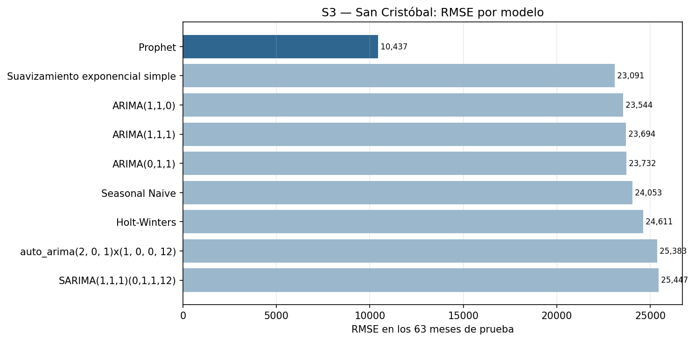

Prophet obtiene por amplio margen el menor RMSE (10,437), aunque su MAPE es
alto porque varios valores observados son pequeños. El resultado se interpreta
como el menos impreciso entre los candidatos, no como un pronóstico exacto.

ARIMA(1,1,0), el candidato ARIMA con menor RMSE, conserva autocorrelación
(`p=0.033`) y no presenta residuos normales según Jarque-Bera (`p<0.001`).
Prophet también conserva autocorrelación (`p<0.001`), por lo que su ventaja
proviene del error fuera de muestra y no de un residuo compatible con ruido
blanco.

### 7.4 Comparación de Fronteras

| Frontera | Fuerza estacional | CAGR 2009–2019 | Pendiente relativa mensual | CV 2009–2019 | Desv. log-diferencias | Caída 2020 vs 2019 |
|---|---:|---:|---:|---:|---:|---:|
| La Aurora | 0.559 | 4.74% | 0.412% | 0.217 | 0.171 | 72.81% |
| Valle Nuevo | 0.311 | 9.69% | 0.778% | 0.398 | 0.369 | 80.72% |
| San Cristóbal | 0.399 | 12.95% | 0.984% | 0.522 | 0.348 | 72.57% |

1. **Mayor estacionalidad: La Aurora.** Su fuerza estacional de 0.559 supera
   a San Cristóbal (0.399) y Valle Nuevo (0.311). El tráfico aéreo muestra el
   patrón anual más repetitivo.
2. **Mayor tendencia de crecimiento: San Cristóbal.** Presenta el mayor CAGR
   prepandemia (12.95%) y la mayor pendiente relativa mensual (0.984%). Valle
   Nuevo tiene la mayor pendiente absoluta en viajeros, pero parte de una
   escala mayor; al normalizar, San Cristóbal crece más rápido.
3. **Mayor volatilidad: resultado mixto.** San Cristóbal tiene el mayor
   coeficiente de variación (0.522), mientras que Valle Nuevo tiene la mayor
   desviación de log-diferencias (0.369 frente a 0.348). Para variación
   estrictamente mes a mes se considera más volátil Valle Nuevo; respecto a
   su nivel promedio, San Cristóbal es el más disperso.
4. **Más afectada por la pandemia: Valle Nuevo.** Su caída anual fue 80.72%,
   frente a 72.81% en La Aurora y 72.57% en San Cristóbal. San Cristóbal
   registró el primer mes nuevamente sobre el promedio mensual de 2019 en
   junio de 2022; La Aurora en julio de 2022 y Valle Nuevo hasta diciembre de
   2022. Ninguna sostuvo todavía, hasta junio de 2026, una media móvil de 12
   meses igual o superior a su promedio de 2019.

## 8. Categoría Países

### 8.1 S4 — El Salvador

> **Pendiente (Persona C).** Análisis completo de S4, incluyendo la
> explicación del cambio de granularidad de `País` desde 2023 y por qué El
> Salvador continúa siendo una serie utilizable, sin presentar el cambio
> metodológico como una caída real.

### 8.2 S5 — Estados Unidos

S5 representa el total mensual asociado con Estados Unidos dentro de la
categoría País. La serie contiene 210 meses y utiliza la misma partición de
147 meses de entrenamiento y 63 meses de prueba. A partir de 2023 existe un
cambio en la granularidad disponible de la variable País, por lo que los
movimientos posteriores deben interpretarse teniendo presente esa limitación
metodológica.

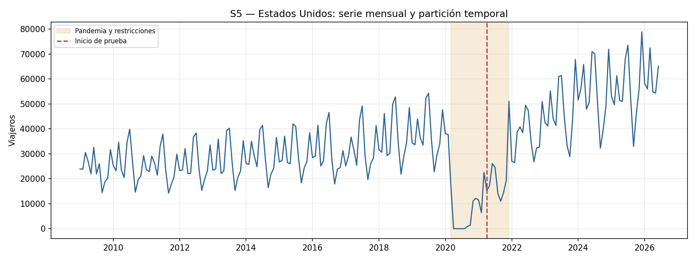

Antes de la pandemia la serie ya mostraba crecimiento y un patrón mensual
marcado. Entre abril y agosto de 2020 aparecen cinco meses en cero, coherentes
con el cierre extraordinario de la movilidad. Después de 2021 la recuperación
es clara y, desde 2023, los valores suelen superar el nivel observado durante
buena parte del entrenamiento.

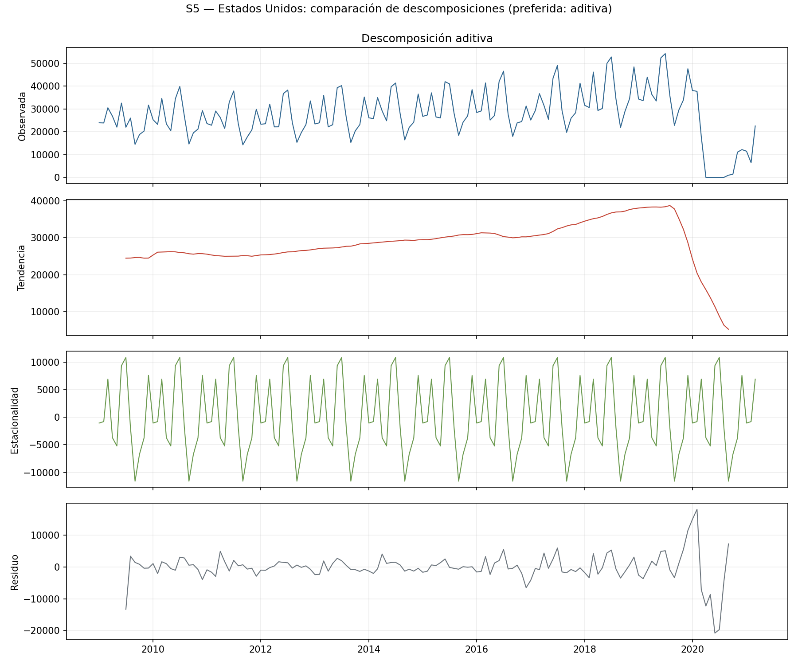

S5 presenta una fuerza de tendencia de 0.709 y una fuerza estacional de 0.704.
Ambos componentes tienen una presencia parecida: existe un crecimiento de
fondo, pero también picos y valles mensuales bastante repetitivos.

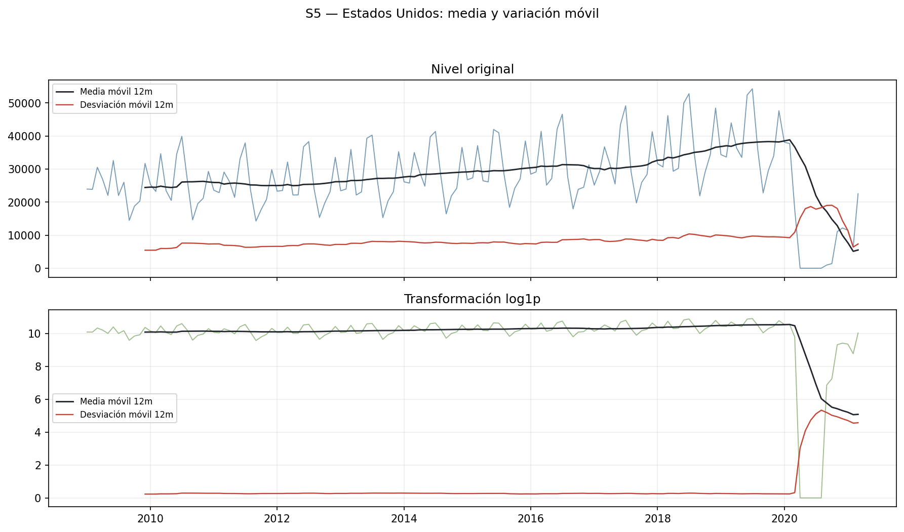

Debido a los cinco meses en cero no se utilizó el logaritmo convencional. En
su lugar se aplicó `log1p`, que admite cero y se comporta de manera similar al
logaritmo para valores grandes.

| Transformación | p ADF | p KPSS | Lectura |
|---|---:|---:|---|
| Nivel | 0.0208 | 0.1000 | Estacionaria según ambas pruebas |
| `log1p` | 0.0821 | 0.1000 | Resultado mixto |
| `log1p` con `d=1` | 0.0487 | 0.1000 | Estacionaria según ambas pruebas |
| `log1p` con `D=1` | 0.9286 | 0.0616 | Resultado mixto |
| `log1p` con `d=1` y `D=1` | <0.0001 | 0.1000 | Estacionaria según ambas pruebas |

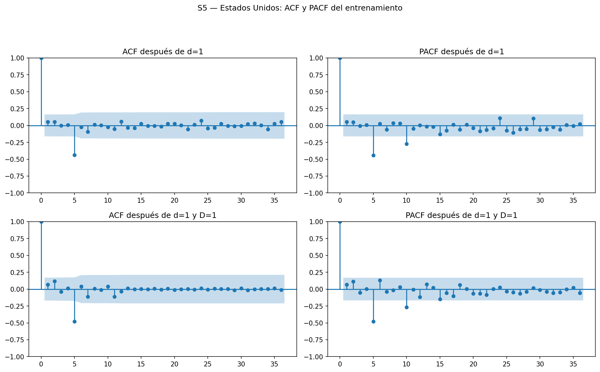

| Modelo | AIC | BIC | MAE | RMSE | MAPE |
|---|---:|---:|---:|---:|---:|
| ARIMA(1,1,1) | 431.91 | 440.82 | 22,975 | 26,794 | 47.08% |
| Prophet | N/A | N/A | 30,362 | 34,044 | 61.31% |
| Holt-Winters | N/A | N/A | 31,255 | 34,099 | 65.24% |
| Suavizamiento exponencial simple | N/A | N/A | 32,302 | 36,174 | 64.28% |
| auto_arima(0,1,0)(0,1,0,12) | 401.66 | 404.55 | 34,755 | 38,985 | 77.78% |
| SARIMA(1,1,1)(0,1,1,12) | 376.88 | 388.03 | 36,709 | 40,429 | 78.86% |
| Seasonal Naive | N/A | N/A | 40,733 | 43,733 | 88.69% |
| SARIMA(2,1,1)(1,1,0,12) | 366.87 | 380.80 | 227.3 billones | 1.35 mil billones | No interpretable |

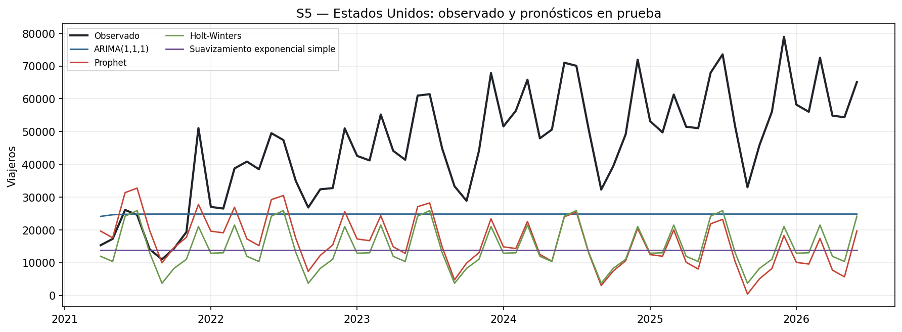
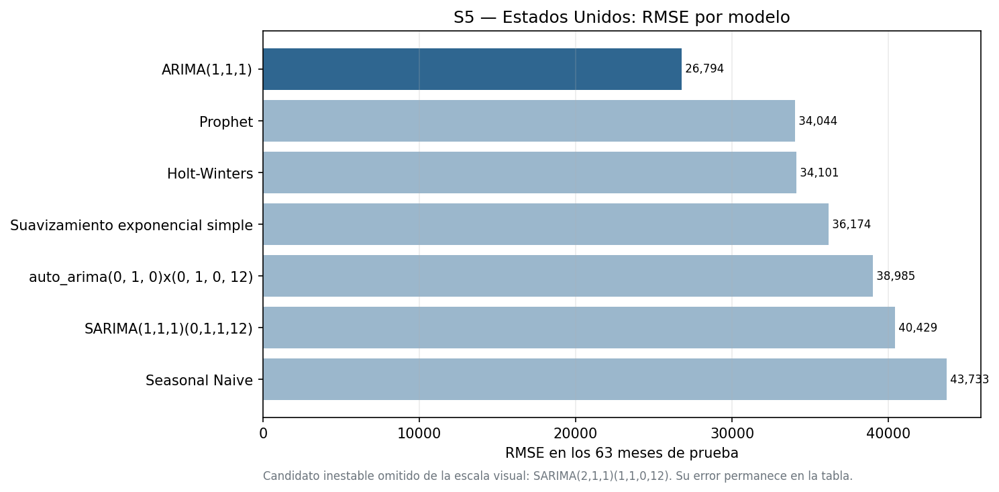

ARIMA(1,1,1) obtuvo el menor RMSE (26,794) y el MAPE más bajo (47.08%). La
figura omite de su escala a SARIMA(2,1,1)(1,1,0,12) porque generó
pronósticos explosivos; el modelo permanece en la tabla como evidencia de que
fue inestable, a pesar de tener el AIC más bajo entre los ARIMA/SARIMA.

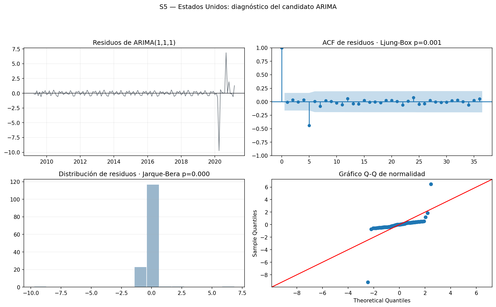

Los residuos de ARIMA(1,1,1) obtuvieron un valor cercano a `p=0.001` en
Ljung-Box, por lo que todavía conservan autocorrelación. El modelo se
mantiene como el candidato con menor RMSE, pero el diagnóstico confirma que
no explica toda la estructura temporal.

### 8.3 S6 — Guatemala

La serie S6 corresponde a viajeros con `País = Guatemala`. Contiene 210
observaciones, sin ceros en entrenamiento, pero con 42 meses consecutivos en
cero en el conjunto de prueba, desde enero de 2023 hasta junio de 2026. Estos
ceros no son una caída real del movimiento migratorio: Guatemala deja de
aparecer como categoría individual de `País` después del cambio de
granularidad de los datos desde 2023. Esta serie representa principalmente el
retorno de residentes guatemaltecos al país y no debe interpretarse como
turismo extranjero.

La gráfica permite distinguir dos fenómenos de naturaleza distinta: la caída
de 2020 es una reducción real de movilidad, y el tramo plano en cero desde
2023 es un cambio de cómo se reporta la variable `País`, no un cierre real de
la frontera.

La fuerza de tendencia sobre el entrenamiento es 0.840 y la fuerza estacional
es 0.506. Estas cifras describen únicamente el tramo de entrenamiento
(2009-2021), que no incluye los ceros de 2023 en adelante.

El entrenamiento de S6 no contiene ceros (mínimo 9,779 viajeros), pero se usa
`log1p` porque la serie sí tiene ceros en prueba y la transformación debe ser
la misma para ajustar e invertir el pronóstico.

| Transformación | p ADF | p KPSS | Lectura |
|---|---:|---:|---|
| Nivel | 0.2136 | 0.0213 | No estacionaria |
| `log1p` | 0.3834 | 0.1000 | Resultado mixto |
| `log1p` con `d=1` | 0.0345 | 0.1000 | Estacionaria según ambas pruebas |
| `log1p` con `D=1` | 0.8729 | 0.0281 | No estacionaria |
| `log1p` con `d=1` y `D=1` | 0.0031 | 0.1000 | Estacionaria según ambas pruebas |

| Modelo | AIC | BIC | MAE | RMSE | MAPE |
|---|---:|---:|---:|---:|---:|
| SARIMA(1,1,1)(0,1,1,12) | 13.42 | 24.57 | 27,317 | 47,260 | 66.22% |
| ARIMA(1,1,1) | 38.66 | 47.57 | 38,592 | 47,440 | 51.24% |
| Suavizamiento exponencial simple | N/A | N/A | 38,141 | 47,373 | 52.04% |
| Holt-Winters | N/A | N/A | 39,157 | 47,913 | 48.10% |
| auto_arima(1,0,1)(1,0,1,12) | 2.27 | 16.72 | 26,050 | 48,043 | 68.23% |
| Seasonal Naive | N/A | N/A | 35,469 | 49,724 | 70.08% |
| SARIMA(2,1,1)(1,1,0,12) | 10.47 | 24.41 | 24,440 | 50,303 | 67.07% |
| Prophet | N/A | N/A | 48,593 | 50,810 | 80.15% |

SARIMA(1,1,1)(0,1,1,12) obtuvo el menor RMSE (47,260). Su MAPE de 66.22% se
calcula únicamente sobre los 21 meses de prueba con valor distinto de cero;
los 42 meses en cero quedan fuera del cálculo por construcción. Ni el
candidato con menor AIC ni el de menor MAE coinciden con el de menor RMSE, y
Prophet, el mejor modelo en S0 y S2, resulta aquí el de peor desempeño: ningún
método domina de forma consistente en las siete series.

El modelo elegido obtiene `p=0.065` en Ljung-Box, sin rechazar la ausencia de
autocorrelación al 5%. Ningún modelo de la comparación fue diseñado para
anticipar que Guatemala dejaría de reportarse como país individual, lo que
infla el error de los últimos 42 meses de prueba para cualquier candidato.

### 8.4 Comparación de Países

> **Pendiente (Persona C).** Con S5 y S6 ya disponibles, falta agregar S4 y
> responder las cuatro preguntas comparativas (estacionalidad, tendencia,
> volatilidad y efecto de la pandemia), separando los cambios reales del
> movimiento migratorio de las limitaciones causadas por el cambio de
> granularidad de `País` desde 2023.

## 9. Comparación general de modelos

> **Pendiente (Persona C).** Tabla global combinando
> `metricas_s0_s5.csv`, `metricas_fronteras.csv` y las métricas de S4–S6
> (`src/evaluacion_modelos.py::combinar_metricas`), con el mejor modelo
> señalado por serie.

## 10. Hallazgos útiles para INGUAT

Los resultados de S0, S1, S2, S3, S5 y S6 permiten adelantar los siguientes
hallazgos prácticos. Deberán complementarse cuando se agregue S4.

1. **La recuperación cambió el nivel de las series más rápido de lo que los
   modelos pudieron aprender.** En el total mensual, las tres fronteras
   analizadas y Estados Unidos, varios pronósticos quedan por debajo de los
   valores observados después de 2022. Para planificación operativa conviene
   actualizar los modelos con frecuencia y no depender durante varios años de
   un ajuste cerrado en marzo de 2021.

2. **La estacionalidad varía notablemente según el punto de entrada.** La
   fuerza estacional fue 0.704 en S5, 0.559 en S1, 0.506 en S6, 0.467 en S0,
   0.399 en S3 y 0.311 en S2. Esto sugiere que la programación de campañas, personal y
   capacidad debe planificarse por mercado y por frontera, y no únicamente con
   el comportamiento promedio del turismo total.

3. **El modelo con menor error todavía puede ser insuficiente para decisiones
   de capacidad.** El mejor RMSE fue aproximadamente 139,549 viajeros en S0,
   38,249 en S1, 23,187 en S2, 10,437 en S3, 26,794 en S5 y 47,260 en S6. Estas diferencias
   son grandes frente al volumen mensual, por lo que los pronósticos deben
   acompañarse de escenarios o márgenes de seguridad cuando se utilicen para
   asignar recursos.

4. **AIC y BIC no deben usarse solos para elegir un modelo.** En S0, S1, S2,
   S3, S5 y S6 hubo candidatos con un ajuste interno atractivo que
   pronosticaron peor, y en S5 apareció un SARIMA numéricamente inestable. La evaluación
   sobre meses no utilizados durante el ajuste y el diagnóstico de residuos
   son indispensables antes de convertir un modelo en una herramienta de
   planificación.

5. **Ningún modelo domina de forma consistente entre series.** Prophet fue el
   mejor en S0, S2 y S3, ARIMA(1,1,1) en S1 y S5, y SARIMA(1,1,1)(0,1,1,12) en
   S6. La elección del método debe hacerse serie por serie, no de forma
   única para todo el sistema turístico.

Además, desde 2023 debe mantenerse visible la advertencia sobre el cambio de
granularidad de la variable País. Una variación posterior a esa fecha puede
combinar un movimiento real de viajeros con una modificación en la forma de
registrar el origen, por lo que no conviene interpretarla automáticamente
como crecimiento o caída del mercado. Esto es especialmente relevante en S6,
donde el cambio produce 42 meses en cero que no representan el fin del
retorno de residentes guatemaltecos.

> **Pendiente (Persona C).** Consolidar estos hallazgos con la evidencia de
> S4 y el comparativo de Países.

## 11. Limitaciones

- El corte 70/30 concentra buena parte de la recuperación pospandemia dentro
  del conjunto de prueba, por lo que los errores de todas las series
  reflejan un cambio de régimen que los modelos no habían visto durante el
  ajuste.
- El cambio de granularidad de la variable `País` desde 2023 limita la
  interpretación de S5 y S6: en S6 produce 42 meses en cero que deben
  excluirse del cálculo de MAPE y no confundirse con una caída real.
- Un candidato SARIMA con `enforce_stationarity=False` produjo
  pronósticos numéricamente inestables al invertir la transformación
  logarítmica en S5. Se documentó en la tabla de métricas en vez de
  ocultarse, y se excluyó únicamente de la escala visual del gráfico
  de barras.
- Los modelos alternativos (Prophet, Holt-Winters, suavizamiento simple,
  Seasonal Naive) no reportan AIC ni BIC por diseño; sus residuos, en varias
  series, conservan autocorrelación según Ljung-Box a pesar de tener buen
  desempeño en prueba.
- Holt-Winters, suavizamiento simple y Seasonal Naive se ejecutan mediante
  adaptadores reproducibles dentro de los módulos de modelado; todos conservan
  la misma partición y horizonte.
- En S1–S3, Jarque-Bera rechaza la normalidad de los residuos ARIMA. Los
  choques extremos de 2020 producen colas que un modelo gaussiano ordinario no
  representa por completo.

> **Pendiente (Persona C).** Agregar las limitaciones específicas de S4.

## 12. Conclusiones

> **Pendiente (Persona C).** Redactar las conclusiones finales del
> laboratorio una vez integradas las siete series, ambos comparativos y la
> tabla global de métricas.
