> **Nota de integración:** este archivo conserva el fragmento S1–S2 preparado para el avance. Para la entrega del Bloque B, la versión canónica y actualizada —con S1, S2, S3 y el comparativo entre fronteras— es la sección 7 de `informe/informe_final.md`, complementada por `informe/secciones/03_s3_comparativo_fronteras.md`. Este fragmento no debe ensamblarse de forma aislada en la entrega final.

# S1 y S2 — Fronteras: La Aurora y Valle Nuevo (fragmento histórico del avance)

## S1 — La Aurora

La serie S1 representa el total mensual de viajeros ingresados por La Aurora,
la principal frontera aérea del país. Contiene 210 observaciones, desde enero
de 2009 hasta junio de 2026, sin meses en cero. Los primeros 147 meses se
utilizaron como entrenamiento y los 63 meses finales como prueba, la misma
partición usada por el resto de las series.

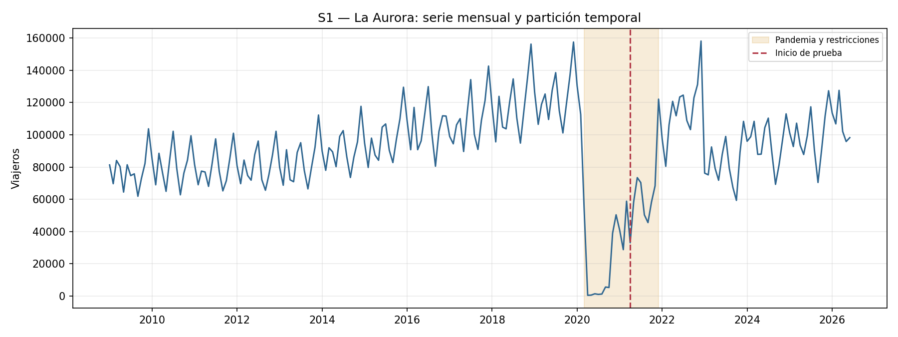

Antes de 2020, La Aurora combina un crecimiento sostenido con picos anuales
propios del tráfico aéreo. En abril de 2020 la serie cae hasta un mínimo de
484 viajeros, una ruptura extraordinaria de la que la recuperación seguía en
curso cuando terminó el entrenamiento. Por eso el desempeño de los modelos en
prueba vuelve a estar condicionado por un cambio de régimen que apenas se
había insinuado antes del corte.

## Tendencia y estacionalidad

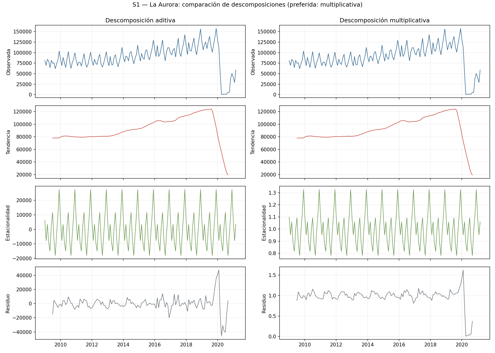

La fuerza de tendencia es 0.811 y la fuerza estacional es 0.559. En
comparación con S0, La Aurora conserva un patrón estacional más marcado,
coherente con la estacionalidad propia del tráfico aéreo de pasajeros. El
residuo de la descomposición se dispara alrededor del cierre de 2020 porque la
descomposición aditiva no está diseñada para explicar una caída tan abrupta.

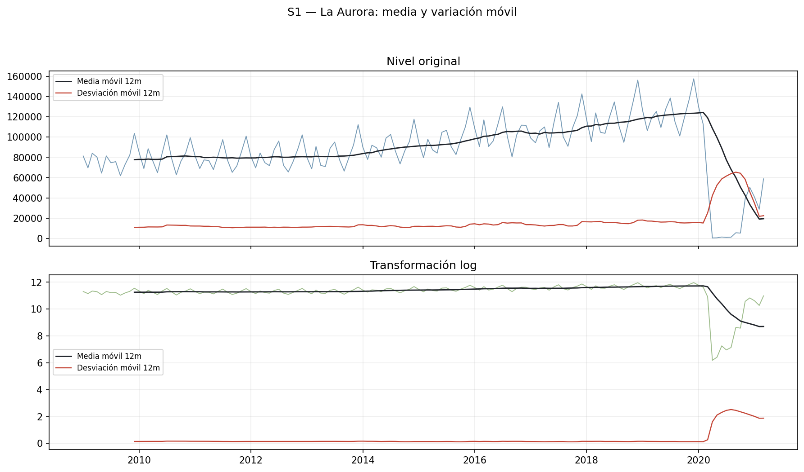

Como S1 no contiene ceros, se aplicó logaritmo completo. La transformación
reduce el peso de los picos de diciembre y facilita comparar la variación
mensual en términos relativos.

## Estacionariedad y selección de órdenes — S1

| Transformación | p ADF | p KPSS | Lectura |
|---|---:|---:|---|
| Nivel | 0.1505 | 0.1000 | Resultado mixto |
| Logaritmo | 0.2726 | 0.1000 | Resultado mixto |
| Logaritmo con `d=1` | 0.0269 | 0.1000 | Estacionaria según ambas pruebas |
| Logaritmo con `D=1` | 0.8311 | 0.0440 | No estacionaria |
| Logaritmo con `d=1` y `D=1` | <0.0001 | 0.1000 | Estacionaria según ambas pruebas |

En logaritmo sin diferenciar, ADF no rechaza la raíz unitaria. Con una
diferencia regular, ADF y KPSS coinciden en que la serie es estacionaria. La
diferencia estacional aislada no es estacionaria por sí sola, por lo que se
evaluó únicamente en combinación con `d=1` dentro de los candidatos SARIMA,
sin asumirla como obligatoria.

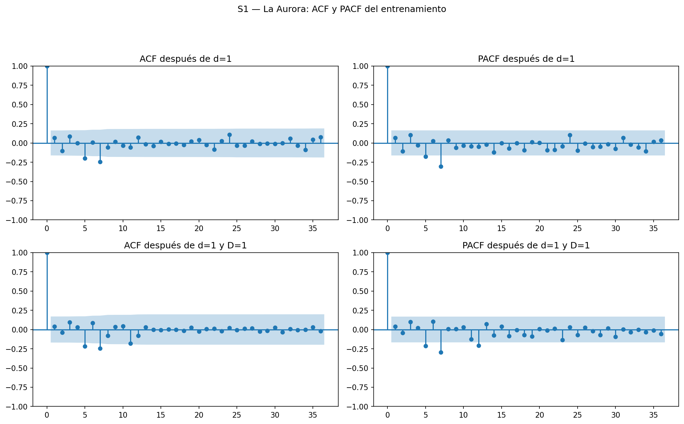

La ACF y la PACF de la serie transformada y diferenciada muestran actividad en
los primeros rezagos y en la zona estacional, lo que justificó comenzar con
órdenes pequeños y contrastarlos con dos alternativas SARIMA. `auto_arima`
propuso un orden regular (1,0,1) y uno estacional (1,0,1,12), sin diferenciar.

## Comparación de modelos y pronóstico — S1

| Modelo | AIC | BIC | MAE | RMSE | MAPE |
|---|---:|---:|---:|---:|---:|
| ARIMA(1,1,1) | 207.03 | 215.94 | 33,051 | 38,251 | 33.08% |
| Suavizamiento exponencial simple | N/A | N/A | 36,822 | 42,053 | 36.56% |
| Holt-Winters | N/A | N/A | 38,906 | 42,889 | 39.49% |
| Prophet | N/A | N/A | 45,973 | 50,963 | 47.47% |
| SARIMA(1,1,1)(0,1,1,12) | 187.11 | 198.26 | 68,213 | 72,424 | 71.997% |
| auto_arima(1,0,1)(1,0,1,12) | 189.57 | 204.03 | 71,903 | 75,901 | 76.29% |
| Seasonal Naive | N/A | N/A | 75,518 | 79,321 | 81.48% |
| SARIMA(2,1,1)(1,1,0,12) | 180.07 | 194.01 | 1.33×10¹³ | 8.96×10¹³ | inestable |

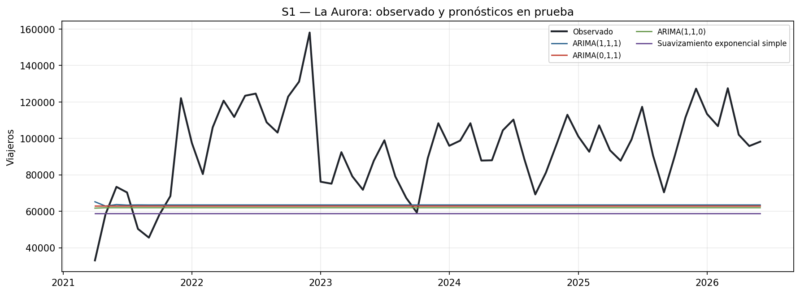

ARIMA(1,1,1) obtuvo el menor RMSE, con 38,251 viajeros, y el menor MAE, con
33,051, el error relativo más bajo entre las tres series de este bloque
(MAPE 33.1%). Prophet y Holt-Winters quedan en segundo y tercer lugar,
en ese orden.

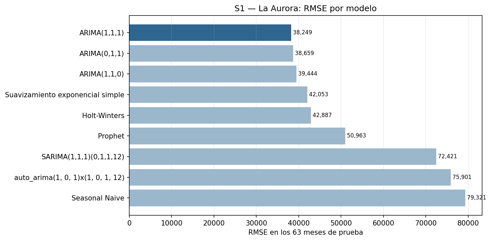

SARIMA(2,1,1)(1,1,0,12) obtuvo el AIC más bajo entre los candidatos
ARIMA/SARIMA de S1, pero al invertir la transformación logarítmica sobre 63
pasos su pronóstico se dispara a un orden de magnitud sin sentido económico.
Se conserva en la tabla como evidencia de por qué fue descartado y se omite
de la escala visual del gráfico de barras, el mismo tratamiento que Persona A
aplicó a un candidato inestable de S5. Este resultado vuelve a confirmar que
un AIC competitivo no garantiza un pronóstico utilizable.

## Diagnóstico de residuos — S1

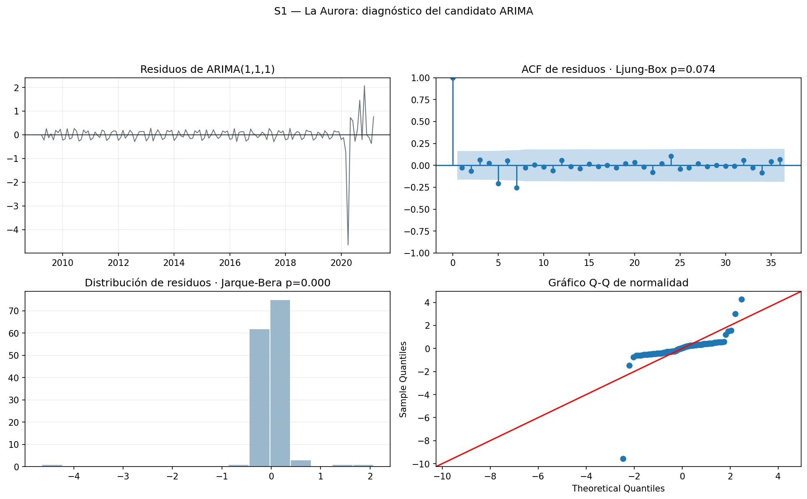

ARIMA(1,1,1) obtiene `p=0.074` en la prueba resumida de Ljung-Box. Al nivel
de 5% no se rechaza la ausencia de autocorrelación, aunque el margen es
estrecho. Como también fue el modelo con menor error en prueba, se selecciona
como el mejor candidato de S1 sin reservas adicionales más allá de la
limitación general del corte pandémico.

---

## S2 — Valle Nuevo

La serie S2 representa el total mensual de viajeros ingresados por Valle
Nuevo, la principal frontera terrestre hacia El Salvador. A diferencia de S1,
esta serie no contaba con exploración, descomposición ni estacionariedad en
el avance; esta sección completa ese análisis. Contiene 210 observaciones,
desde enero de 2009 hasta junio de 2026, con un mínimo de 80 viajeros en
entrenamiento y sin meses en cero.

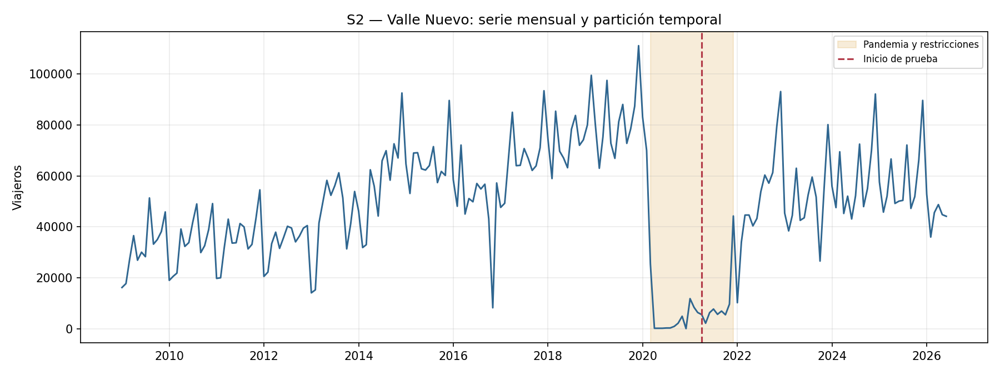

Valle Nuevo muestra el mismo quiebre pandémico que las demás series: cae a
niveles mínimos durante 2020 y todavía estaba recuperándose cuando terminó el
entrenamiento, por lo que la prueba vuelve a ser exigente para todos los
modelos.

## Tendencia y estacionalidad

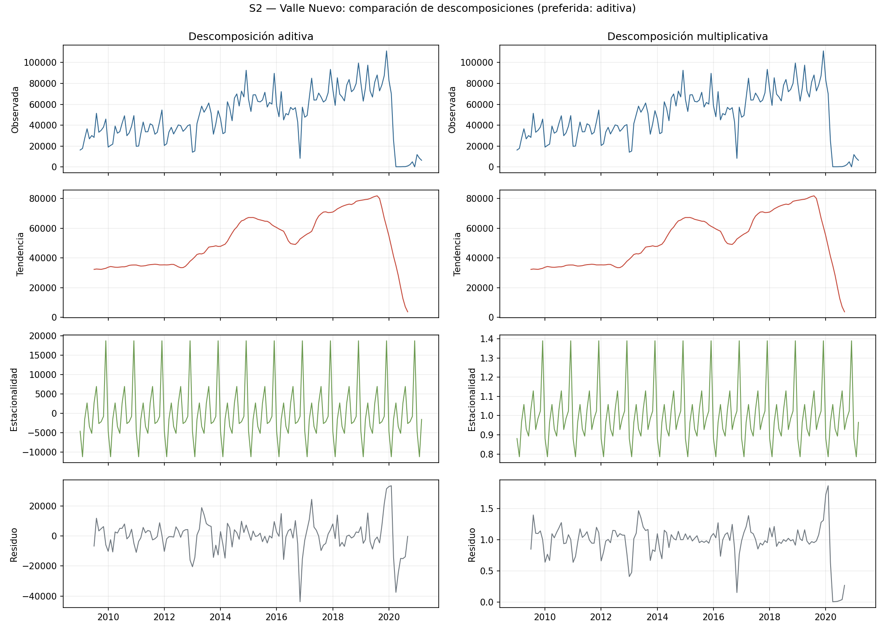

La fuerza de tendencia es 0.766, frente a una fuerza estacional de
0.311. A diferencia de La Aurora, el tráfico terrestre de Valle Nuevo
tiene un patrón mensual más plano y un crecimiento de fondo más marcado antes
de 2020.

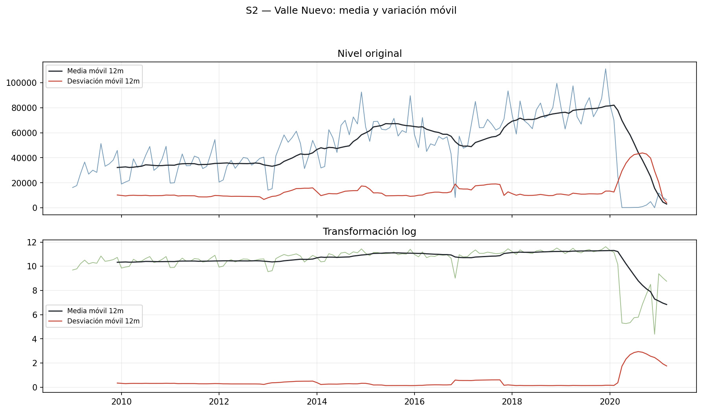

Como S2 tampoco contiene ceros, se aplicó logaritmo completo. La
transformación reduce la influencia de los picos y estabiliza la variación
para comparar años distintos.

## Estacionariedad y selección de órdenes — S2

| Transformación | p ADF | p KPSS | Lectura |
|---|---:|---:|---|
| Nivel | 0.3648 | 0.0636 | Resultado mixto |
| Logaritmo | 0.1952 | 0.1000 | Resultado mixto |
| Logaritmo con `d=1` | <0.0001 | 0.1000 | Estacionaria según ambas pruebas |
| Logaritmo con `D=1` | 0.7827 | 0.0256 | No estacionaria |
| Logaritmo con `d=1` y `D=1` | <0.0001 | 0.1000 | Estacionaria según ambas pruebas |

En logaritmo sin diferenciar, ADF no rechaza la raíz unitaria. Con una
diferencia regular, ADF y KPSS coinciden en estacionariedad. Igual que en S1,
la diferencia estacional aislada no es estacionaria por sí sola, así que se
probó solo combinada con `d=1` dentro de los candidatos SARIMA.

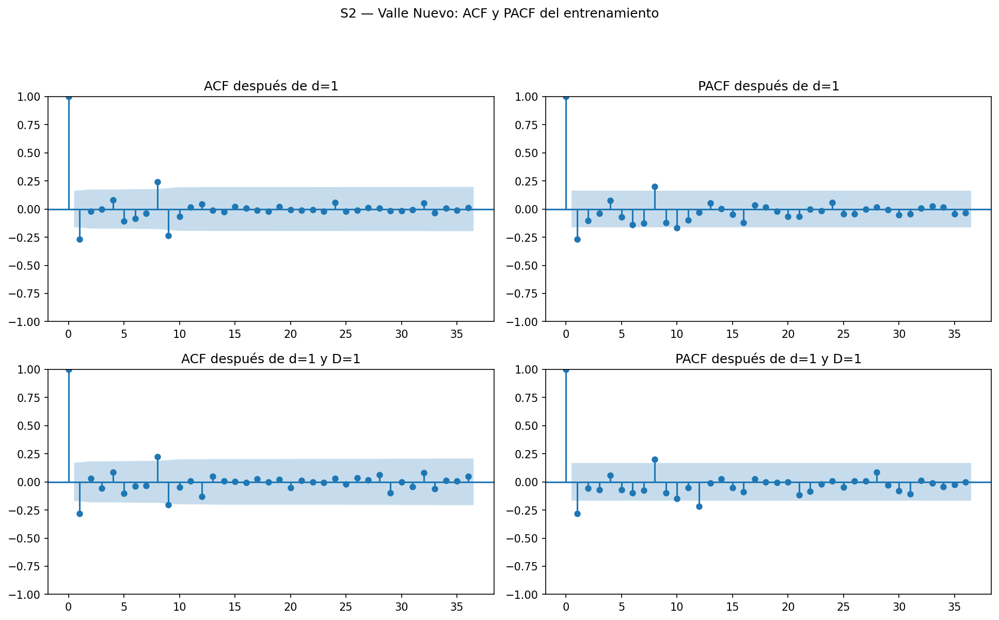

La ACF y la PACF de la serie transformada y diferenciada muestran patrones
similares a los de S1, lo que justificó usar el mismo conjunto de candidatos
manuales. `auto_arima` propuso un orden regular (1,0,1) sin componente
estacional (0,0,0,12).

## Comparación de modelos y pronóstico — S2

| Modelo | AIC | BIC | MAE | RMSE | MAPE |
|---|---:|---:|---:|---:|---:|
| Prophet | N/A | N/A | 16,804 | 23,187 | 157.64% |
| Holt-Winters | N/A | N/A | 35,239 | 38,126 | 85.37% |
| Suavizamiento exponencial simple | N/A | N/A | 40,770 | 45,663 | 79.97% |
| ARIMA(1,1,1) | 329.50 | 338.41 | 41,519 | 46,452 | 80.52% |
| auto_arima(1,0,1)(0,0,0,12) | 330.98 | 339.91 | 43,693 | 48,726 | 84.83% |
| Seasonal Naive | N/A | N/A | 44,707 | 49,661 | 91.39% |
| SARIMA(1,1,1)(0,1,1,12) | 303.09 | 314.24 | 47,115 | 51,806 | 96.96% |
| SARIMA(2,1,1)(1,1,0,12) | 303.19 | 317.13 | 47,228 | 51,923 | 96.88% |

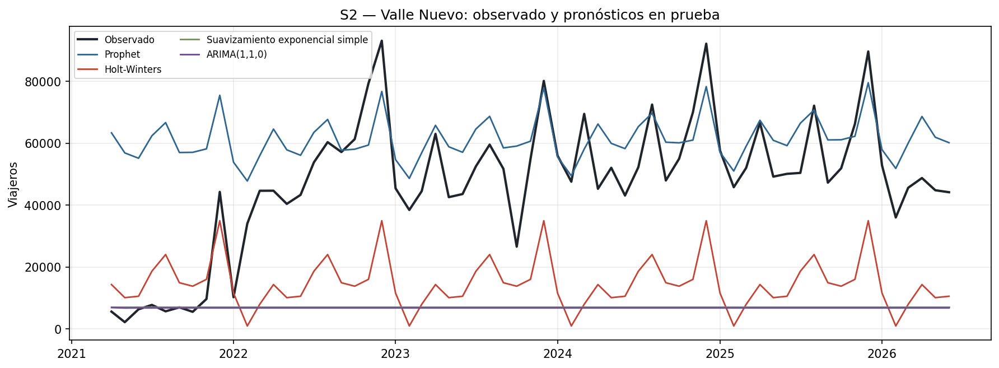

Prophet obtuvo claramente el menor RMSE, con 23,187 viajeros, muy por debajo
del siguiente candidato (Holt-Winters, 38,126). Sin embargo, su MAPE es
157.6%, superior a 100% porque algunos meses de prueba tienen valores
observados pequeños frente al error absoluto. Por eso el MAPE se reporta solo
como referencia adicional y la selección del mejor modelo se basa en RMSE.

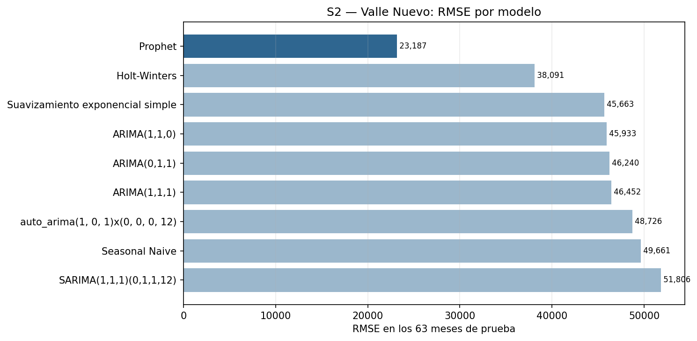

A diferencia de S1, ningún candidato ARIMA/SARIMA de S2 produjo un pronóstico
inestable: los dos SARIMA quedan con RMSE similar entre sí y ninguno se
dispara fuera de escala.

## Diagnóstico de residuos — S2

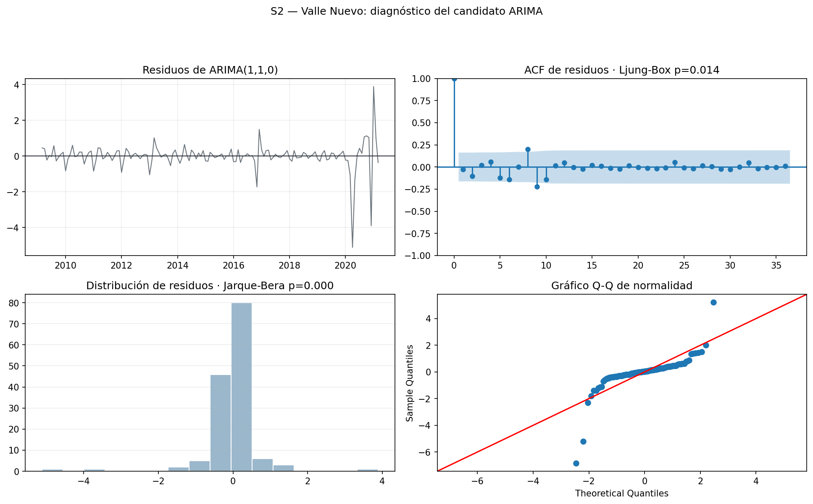

Los residuos de Prophet conservan autocorrelación (Ljung-Box `p≈0.0000`), a
pesar de tener el menor error en prueba. Entre los candidatos ARIMA/SARIMA,
ARIMA(1,1,1) tiene el residuo más cercano a ruido blanco (`p=0.055`, cerca del
umbral de 5%), pero su RMSE duplica al de Prophet. La conclusión es la misma
que en S0: el candidato con mejor diagnóstico de residuos no es
necesariamente el que mejor pronostica fuera de muestra.

---

## Nota de entrega para el comparativo de Fronteras

Las tablas de S1 y S2 quedan en un formato homogéneo dentro de
`data/processed/resultados/metricas_s1_s2_s6.csv`, junto con la
estacionariedad y los pronósticos completos en
`estacionariedad_s1_s2_s6.csv` y `pronosticos_s1_s2_s6.csv`. Con esta
evidencia, Persona C puede completar el comparativo de Fronteras agregando
S3 — San Cristóbal y respondiendo, con la misma evidencia normalizada, cuál
frontera tiene mayor estacionalidad, mayor tendencia de crecimiento, mayor
volatilidad y mayor efecto de la pandemia.
