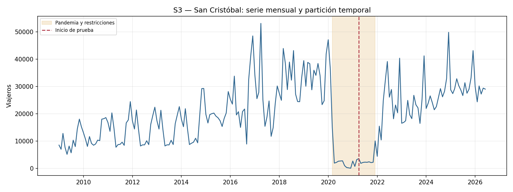
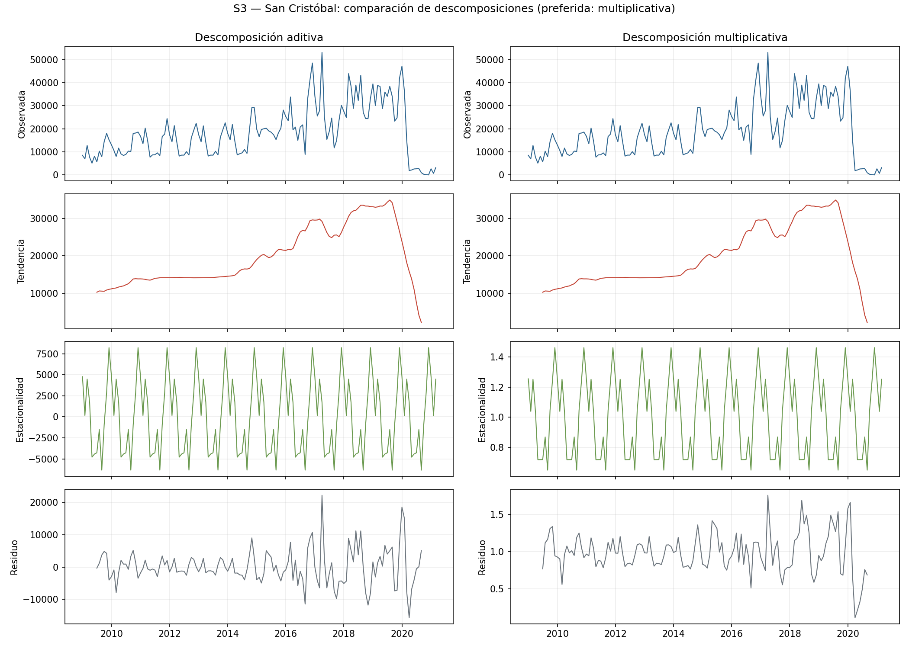
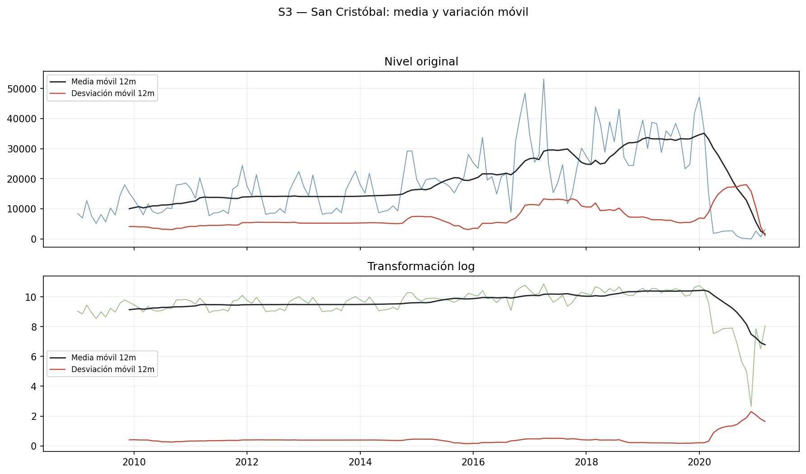
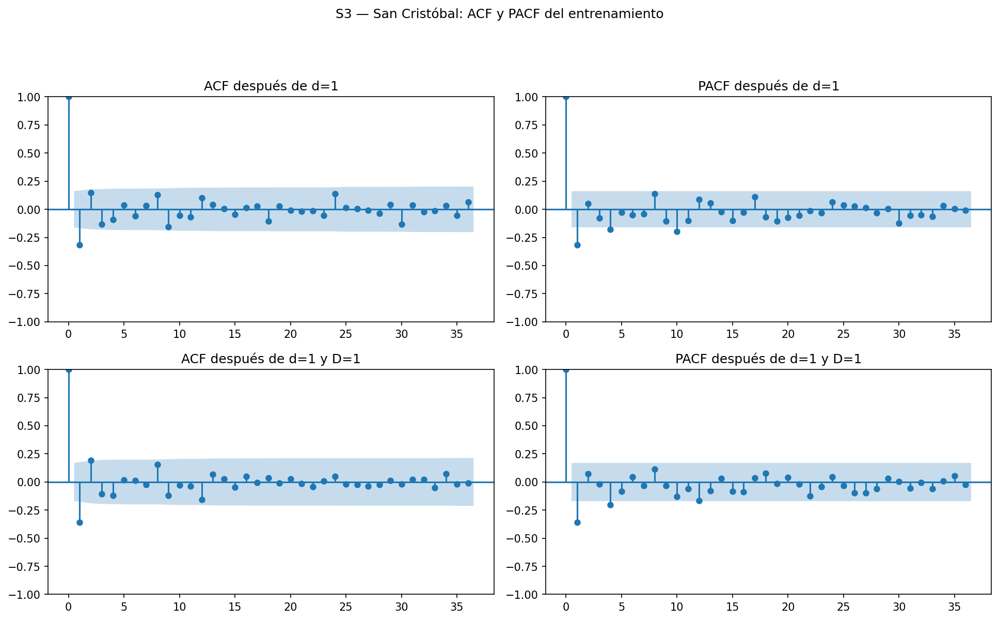
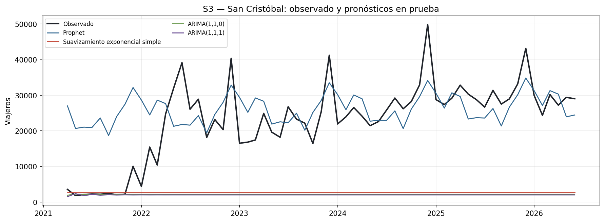
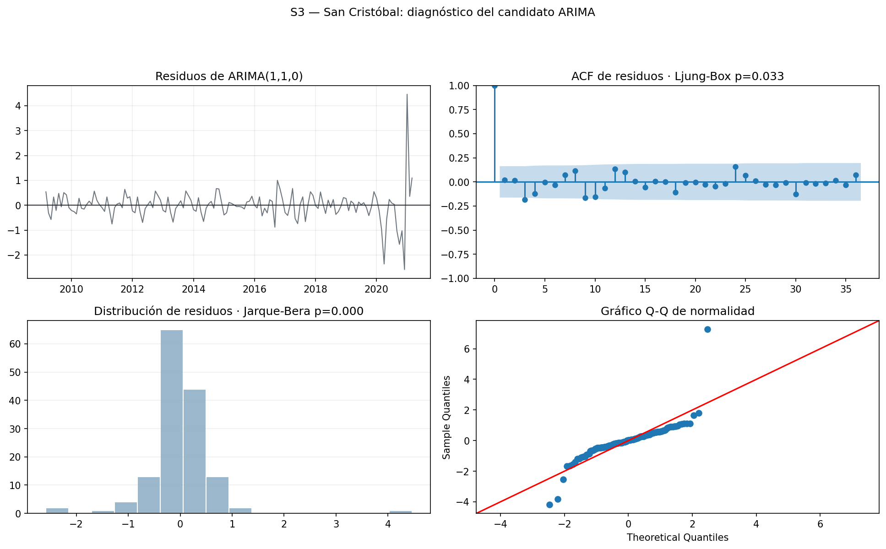

# S3 — San Cristóbal y comparativo de Fronteras

S3 corresponde a San Cristóbal, la segunda frontera terrestre del Top 3.
Contiene 210 meses, desde enero de 2009 hasta junio de 2026, sin ceros; el
mínimo del entrenamiento es 14 viajeros.

Antes de 2020 la serie crece con oscilaciones relativas mayores que S1 y S2.
La fuerza de tendencia es 0.707 y la fuerza estacional 0.399. La correlación
media-desviación prepandemia fue 0.529, por lo que se prefiere la
descomposición multiplicativa. El logaritmo reduce esa correlación a -0.468.

| Transformación | p ADF | p KPSS | Lectura |
|---|---:|---:|---|
| Nivel | 0.5854 | 0.0208 | No estacionaria |
| Logaritmo | 0.2527 | 0.1000 | Resultado mixto |
| Logaritmo con `d=1` | 0.9121 | 0.1000 | Resultado mixto |
| Logaritmo con `D=1` | 0.9269 | 0.0242 | No estacionaria |
| Logaritmo con `d=1,D=1` | 0.0002 | 0.1000 | Estacionaria |

S3 requiere `d=1,D=1`. La señal principal de ACF y PACF después de `d=1`
está en el rezago 1, por lo que se comparan términos AR(1), MA(1), su
combinación y un SARIMA anual.

| Modelo | AIC | BIC | MAE | RMSE | MAPE |
|---|---:|---:|---:|---:|---:|
| Prophet | N/A | N/A | 7,723 | 10,437 | 146.89% |
| Suavizamiento exponencial simple | N/A | N/A | 20,483 | 23,091 | 80.03% |
| ARIMA(1,1,0) | 274.72 | 280.67 | 20,897 | 23,544 | 80.26% |
| ARIMA(1,1,1) | 273.96 | 282.87 | 21,067 | 23,694 | 81.87% |
| ARIMA(0,1,1) | 274.74 | 280.68 | 21,094 | 23,732 | 81.59% |
| Seasonal Naive | N/A | N/A | 21,408 | 24,053 | 86.23% |
| Holt-Winters | N/A | N/A | 22,180 | 24,611 | 94.08% |
| auto_arima(2,0,1)(1,0,0,12) | 254.16 | 268.62 | 22,870 | 25,383 | 96.50% |
| SARIMA(1,1,1)(0,1,1,12) | 239.04 | 250.19 | 22,941 | 25,447 | 97.19% |

Prophet obtiene el menor RMSE. ARIMA(1,1,0), el ARIMA con menor error, conserva
autocorrelación (`p=0.033`) y no presenta normalidad según Jarque-Bera.

## Comparación de Fronteras

| Frontera | Fuerza estacional | CAGR 2009–2019 | Pendiente relativa mensual | CV | Desv. log-diferencias | Caída 2020 vs 2019 |
|---|---:|---:|---:|---:|---:|---:|
| La Aurora | 0.559 | 4.74% | 0.412% | 0.217 | 0.171 | 72.81% |
| Valle Nuevo | 0.311 | 9.69% | 0.778% | 0.398 | 0.369 | 80.72% |
| San Cristóbal | 0.399 | 12.95% | 0.984% | 0.522 | 0.348 | 72.57% |

- **Mayor estacionalidad:** La Aurora.
- **Mayor crecimiento relativo:** San Cristóbal.
- **Mayor volatilidad mensual:** Valle Nuevo; San Cristóbal tiene la mayor
  dispersión relativa al nivel según el coeficiente de variación.
- **Mayor efecto pandémico:** Valle Nuevo. Cayó 80.72% y fue la última en
  registrar un mes al nivel promedio de 2019, en diciembre de 2022.

Ninguna de las tres sostuvo todavía, hasta junio de 2026, una media móvil de
12 meses igual o superior a su promedio mensual de 2019.
