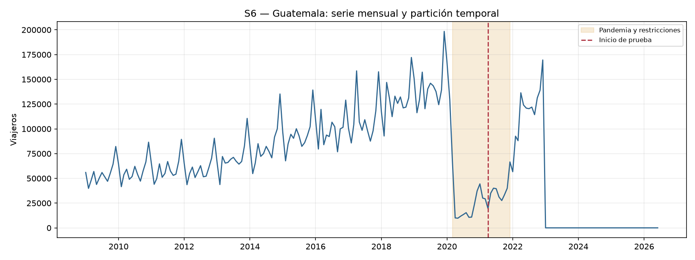
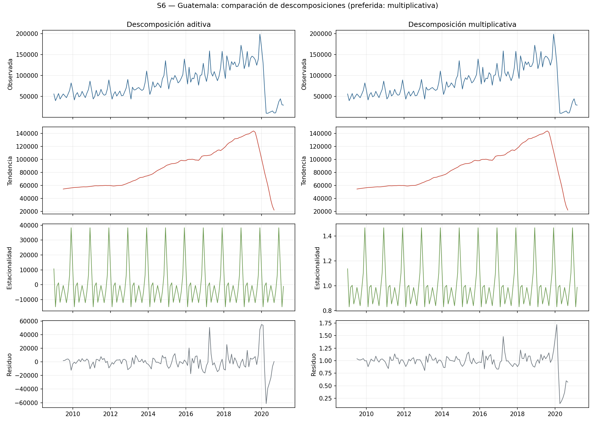
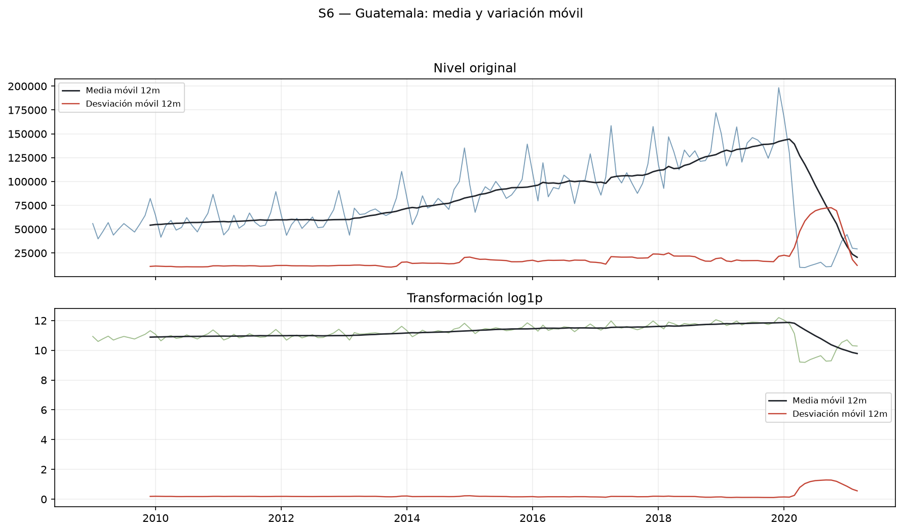
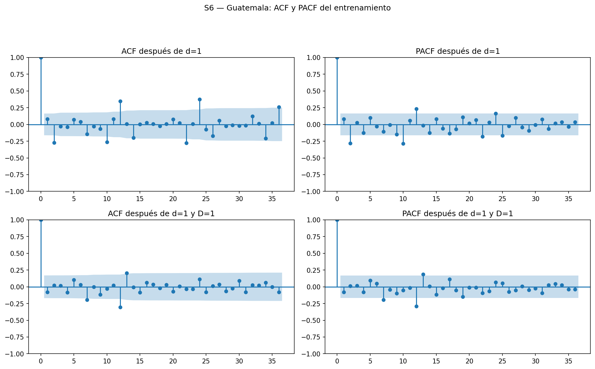
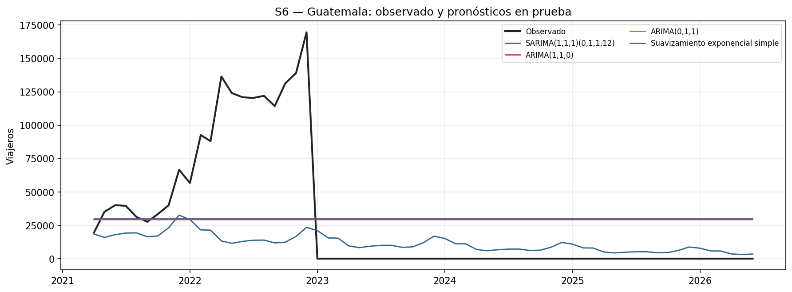
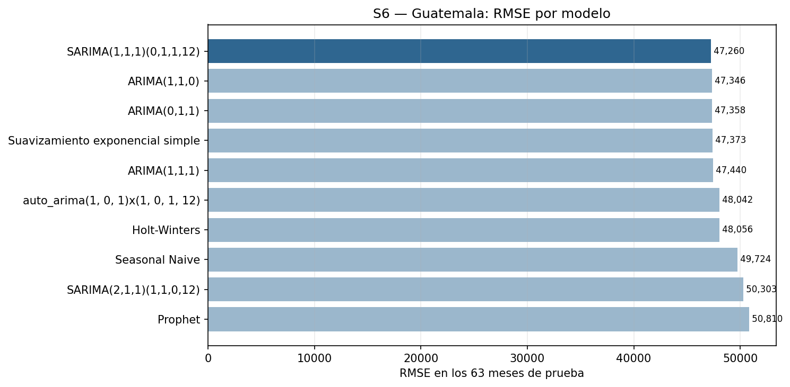
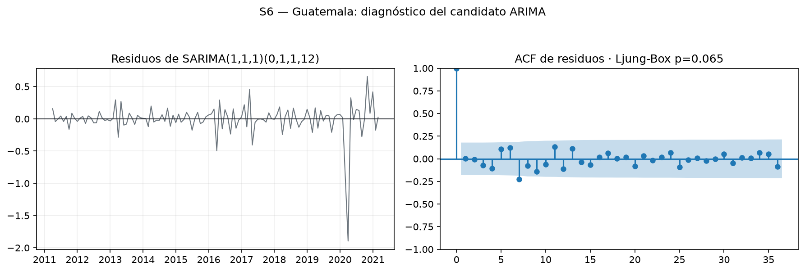

> **Nota de integración:** este fragmento precede a la ejecución unificada de
> S4–S6. Para la entrega se debe usar la sección 8 de
> `informe/informe_final.md`, que contiene S4–S6 con la misma plantilla y las
> métricas regeneradas.

# S6 — Guatemala (fragmento histórico)

La serie S6 corresponde a viajeros con `País = Guatemala`. Contiene 210
observaciones, desde enero de 2009 hasta junio de 2026, sin ceros en
entrenamiento, pero con 42 meses consecutivos en cero en el conjunto de
prueba, desde enero de 2023 hasta junio de 2026. Estos ceros no son una caída
real del movimiento migratorio: Guatemala deja de aparecer como categoría
individual de `País` después del cambio de granularidad de los datos desde
2023. Además, esta serie representa principalmente el retorno de residentes
guatemaltecos al país, y no debe interpretarse como turismo extranjero, a
diferencia de El Salvador o Estados Unidos.

La gráfica permite distinguir dos fenómenos de naturaleza distinta. La caída
de 2020 es una reducción real de movilidad durante el cierre pandémico. El
tramo plano en cero desde 2023 en adelante, en cambio, es un cambio de cómo
se reporta la variable `País` y no un cierre real de la frontera. Confundir
ambos fenómenos llevaría a una interpretación equivocada de la serie.

## Tendencia y estacionalidad

La fuerza de tendencia estimada sobre el entrenamiento es 0.840 y la
fuerza estacional es 0.506. Estas cifras describen únicamente el
tramo de entrenamiento, enero de 2009 a marzo de 2021, que no incluye los
ceros de 2023 en adelante, porque el cambio de granularidad ocurre después del
corte oficial 70/30. La serie muestra, entonces, un comportamiento de tendencia
y estacionalidad comparable al de las demás series de Países antes de la
pandemia.

El entrenamiento de S6 no contiene ceros, con un mínimo de 9,779 viajeros. Aun
así, se utiliza `log1p` en vez de logaritmo completo, porque la serie sí
tiene ceros en el período de prueba y la transformación usada para ajustar
debe ser la misma que se invierte al pronosticar. Usar logaritmo común habría
funcionado sobre el entrenamiento, pero produciría un error en cuanto se
intentara aplicar la misma transformación a cualquier mes en cero.

## Estacionariedad y selección de órdenes

| Transformación | p ADF | p KPSS | Lectura |
|---|---:|---:|---|
| Nivel | 0.2136 | 0.0213 | No estacionaria |
| `log1p` | 0.3834 | 0.1000 | Resultado mixto |
| `log1p` con `d=1` | 0.0345 | 0.1000 | Estacionaria según ambas pruebas |
| `log1p` con `D=1` | 0.8729 | 0.0281 | No estacionaria |
| `log1p` con `d=1` y `D=1` | 0.0031 | 0.1000 | Estacionaria según ambas pruebas |

En `log1p` sin diferenciar, el resultado es mixto: KPSS sugiere
estacionariedad, pero ADF no la rechaza de forma concluyente. Con una
diferencia regular, ADF y KPSS coinciden en que la serie es estacionaria. La
diferencia estacional aislada no es estacionaria por sí sola, así que,
igual que en S1 y S2, se probó únicamente en combinación con `d=1` dentro de
los candidatos SARIMA.

La ACF y la PACF de la serie transformada y diferenciada muestran un patrón
similar al de las demás series del equipo, lo que justificó usar el mismo
conjunto de candidatos manuales. `auto_arima` propuso un orden regular (1,0,1)
y uno estacional (1,0,1,12).

## Comparación de modelos y pronóstico

| Modelo | AIC | BIC | MAE | RMSE | MAPE |
|---|---:|---:|---:|---:|---:|
| SARIMA(1,1,1)(0,1,1,12) | 13.42 | 24.57 | 27,317 | 47,260 | 66.22% |
| ARIMA(1,1,1) | 38.66 | 47.57 | 38,592 | 47,440 | 51.24% |
| Suavizamiento exponencial simple | N/A | N/A | 38,141 | 47,373 | 52.04% |
| Holt-Winters | N/A | N/A | 39,157 | 47,913 | 48.10% |
| auto_arima(1,0,1)(1,0,1,12) | 2.27 | 16.72 | 26,050 | 48,043 | 68.23% |
| Seasonal Naive | N/A | N/A | 35,469 | 49,724 | 70.08% |
| SARIMA(2,1,1)(1,1,0,12) | 10.47 | 24.41 | 24,440 | 50,303 | 67.07% |
| Prophet | N/A | N/A | 48,593 | 50,810 | 80.15% |

SARIMA(1,1,1)(0,1,1,12) obtuvo el menor RMSE, con 47,260 viajeros. El MAPE de
66.22% se calcula únicamente sobre los 21 meses de prueba con valor
distinto de cero; los 42 meses en cero quedan fuera del cálculo por
construcción, porque dividir entre cero no está definido. Ese comportamiento
es exactamente el que se espera del cálculo de MAPE seguro usado en todo el
proyecto, y no debe leerse como un dato faltante.

Ni el candidato con menor AIC (`auto_arima(1,0,1)(1,0,1,12)`, AIC 2.27) ni el
de menor MAE (SARIMA(2,1,1)(1,1,0,12), MAE 24,440) coinciden con el modelo de
menor RMSE: ambos presentan un RMSE ligeramente superior al del modelo
elegido. Este resultado, igual que en S0 y S5, confirma que ningún criterio
aislado —ni AIC, ni MAE— basta para seleccionar el mejor modelo; también
Prophet, el mejor modelo en S0 y S2, resulta aquí el de peor desempeño, lo
que muestra que ningún método domina de forma consistente en las siete series.

## Diagnóstico de residuos

SARIMA(1,1,1)(0,1,1,12) obtiene `p=0.065` en la prueba resumida de
Ljung-Box. Al nivel de 5% no se rechaza la ausencia de autocorrelación, aunque
el resultado está cerca del umbral. Ningún modelo de la comparación fue
diseñado para anticipar que Guatemala dejaría de reportarse como país
individual: todos pronostican valores positivos donde la serie real vale cero
desde 2023, lo que infla el error de los últimos 42 meses de prueba para
cualquier candidato. Esta limitación debe explicarse junto con las métricas de
S6 y no atribuirse a una caída real del turismo o la migración.

## Integración con el comparativo de Países

Las métricas de S6 quedan en el mismo formato homogéneo que S1 y S2, dentro
de `data/processed/resultados/metricas_s1_s2_s6.csv`, junto con la
estacionariedad completa en `estacionariedad_s1_s2_s6.csv`. Con esta
evidencia se integraron S4 y S5 en el comparativo de Países, separando los
cambios reales del movimiento migratorio de las limitaciones causadas por el
cambio de granularidad de `País` desde 2023.
