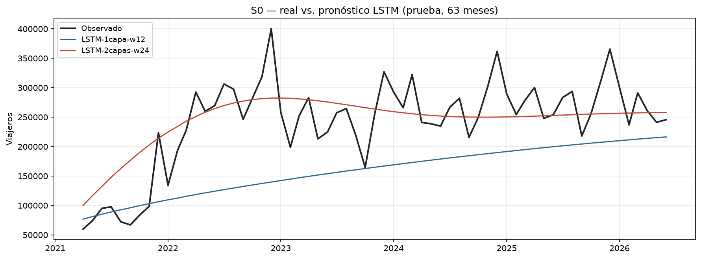
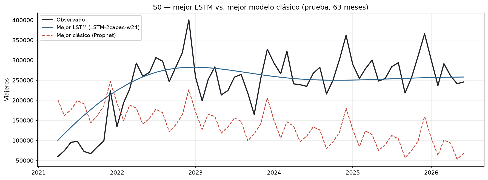

# LSTM — S0 (Total mensual)

Para S0 se entrenaron dos configuraciones de LSTM sobre los mismos 147 meses
de entrenamiento y los mismos 63 meses de prueba usados en el Laboratorio 1,
con pronóstico recursivo multi-step: en ningún paso se utiliza un valor real
del conjunto de prueba. El escalador (`MinMaxScaler`) se ajustó únicamente
con el tramo de entrenamiento.

## Comparación de las dos configuraciones

| Modelo | `lookback` | Capas | Dropout | MAE | RMSE | MAPE |
|---|---:|---:|---:|---:|---:|---:|
| LSTM-1capa-w12 | 12 | 1 | 0.0 | 85,373 | 101,263 | 32.67% |
| LSTM-2capas-w24 | 24 | 2 | 0.2 | 39,077 | 50,988 | 23.44% |

**¿Cuál de las dos LSTM predijo mejor y por qué?** LSTM-2capas-w24 predijo
sustancialmente mejor: reduce el RMSE en prueba en más de 49% respecto a
LSTM-1capa-w12 (de 101,263 a 50,988) y el MAPE baja de 32.67% a 23.44%. La
ventana de 24 meses le da al modelo dos ciclos anuales completos en cada
paso, en lugar de uno solo, lo que ayuda a capturar mejor el patrón
estacional de S0. La segunda capa LSTM añade capacidad para combinar esa
información estacional con la tendencia de recuperación pospandemia, y el
dropout de 0.2 evita que esa capacidad adicional sobreajuste una serie de
entrenamiento relativamente corta (147 meses). El resultado es un modelo más
profundo que generaliza mejor en los 63 meses de prueba, no solo uno que
ajusta mejor el entrenamiento.

## Comparación contra el mejor modelo del Laboratorio 1

| Modelo | Tipo | MAE | RMSE | MAPE |
|---|---|---:|---:|---:|
| LSTM-2capas-w24 | LSTM (mejor) | 39,077 | 50,988 | 23.44% |
| Prophet | Clásico (mejor del Laboratorio 1) | 132,304 | 139,549 | 60.89% |

**¿El mejor LSTM de S0 superó al mejor modelo del Laboratorio 1?** Sí, con
una diferencia grande: el RMSE del mejor LSTM (50,988) es aproximadamente
63% menor que el de Prophet (139,549), y el MAE y el MAPE bajan en una
proporción similar. La gráfica muestra que el LSTM sigue de forma mucho más
cercana la recuperación pospandemia que Prophet, que subestima buena parte
de ese tramo del período de prueba. La ventana recursiva de la LSTM, al
reinyectar sus propias predicciones paso a paso, logra adaptarse al cambio
de nivel de una forma que el componente de tendencia lineal de Prophet no
alcanza a capturar con la misma información de entrenamiento.
