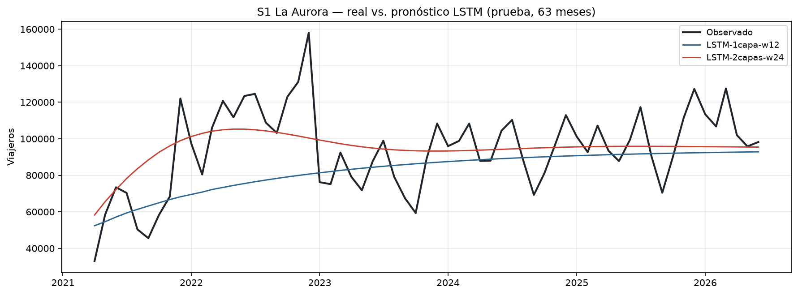
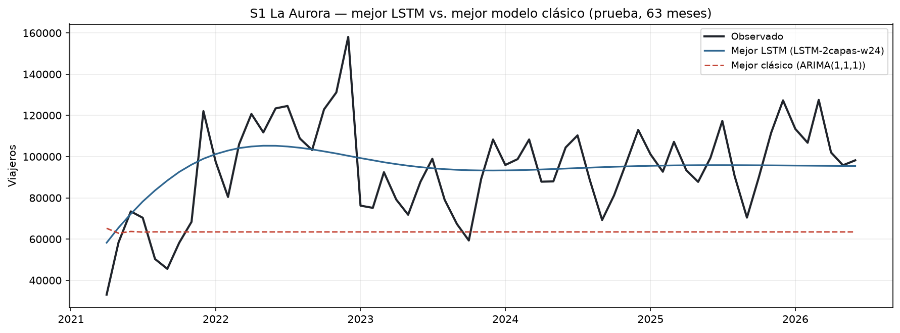

# LSTM — S1 (La Aurora)

Para `S1_la_aurora` se utilizaron los mismos 147 meses de entrenamiento y
63 meses de prueba del Laboratorio 1. Las entradas se escalaron con un
`MinMaxScaler` ajustado exclusivamente sobre entrenamiento. Los pronósticos
se generaron de forma recursiva: cada valor estimado se reincorporó a la
ventana para calcular el siguiente mes, sin utilizar observaciones reales del
conjunto de prueba.

## Comparación de las configuraciones LSTM

| Modelo | Ventana | Unidades | Capas | Dropout | MAE | RMSE | MAPE |
|---|---:|---:|---:|---:|---:|---:|---:|
| LSTM-1capa-w12 | 12 | 50 | 1 | 0.0 | 17,851 | 23,958 | 18.30% |
| LSTM-2capas-w24 | 24 | 64 | 2 | 0.2 | 14,873 | 18,998 | 18.25% |

La configuración `LSTM-2capas-w24` obtuvo el menor error de prueba. Frente a
`LSTM-1capa-w12`, redujo el RMSE en 20.70% y el MAE en 16.68%. El MAPE fue
prácticamente igual en ambas configuraciones, con una diferencia de solo
0.05 puntos porcentuales. Por ello, la selección se sustenta principalmente
en la mejora consistente de RMSE y MAE, siguiendo el criterio acordado de
priorizar RMSE.

La configuración ganadora modificó simultáneamente la longitud de ventana,
el número de unidades, la profundidad y el dropout. Los resultados permiten
afirmar que esa configuración completa generalizó mejor en el período de
prueba, pero no permiten atribuir la mejora a un hiperparámetro aislado sin
realizar experimentos adicionales.

## Comparación con el mejor modelo del Laboratorio 1

Entre los modelos clásicos de S1, el menor RMSE correspondió a
`ARIMA(1,1,1)`. Ambos modelos se evaluaron sobre los mismos 63 meses.

| Modelo | Tipo | MAE | RMSE | MAPE |
|---|---|---:|---:|---:|
| LSTM-2capas-w24 | LSTM | 14,873 | 18,998 | 18.25% |
| ARIMA(1,1,1) | Clásico | 33,049 | 38,249 | 33.08% |

El mejor LSTM superó a `ARIMA(1,1,1)` en las tres métricas: redujo el MAE en
55.00%, el RMSE en 50.33% y el MAPE en 14.83 puntos porcentuales. La gráfica
muestra que el ARIMA converge rápidamente a un pronóstico casi constante
alrededor de 63 mil viajeros y subestima el nivel observado durante gran
parte de la recuperación. La trayectoria del LSTM se aproxima mejor al nuevo
nivel de la serie, especialmente desde 2022, aunque también suaviza la
variabilidad mensual y no reproduce los picos más altos.

## Conclusión conjunta de S0 y S1

En ambas series, la configuración con ventana de 24 meses y dos capas obtuvo
menor RMSE que la alternativa con ventana de 12 meses y una capa. Además, el
mejor LSTM superó al mejor modelo clásico: la reducción relativa de RMSE fue
63.46% para S0 y 50.33% para S1. Esto muestra una ventaja consistente de las
configuraciones evaluadas durante el período de recuperación, pero no basta
para concluir que la misma arquitectura será superior en otras series o en
otros horizontes temporales.

## Limitaciones

- Solo se compararon dos combinaciones de hiperparámetros; no se realizó una
  búsqueda exhaustiva ni un estudio de ablación.
- El horizonte de 63 meses contiene un cambio importante de nivel posterior
  a la pandemia, por lo que el resultado depende de ese período particular.
- El pronóstico recursivo acumula sus propios errores y tiende a producir
  trayectorias más suaves que las observaciones mensuales.
